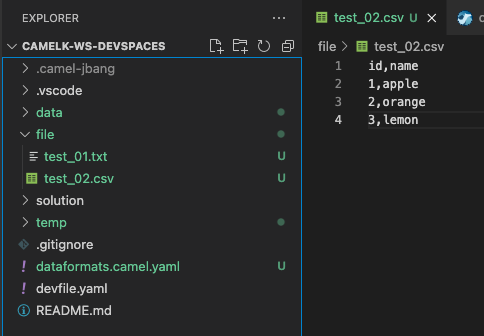
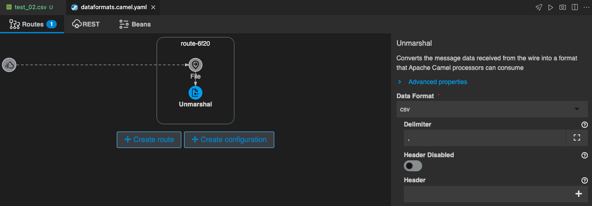
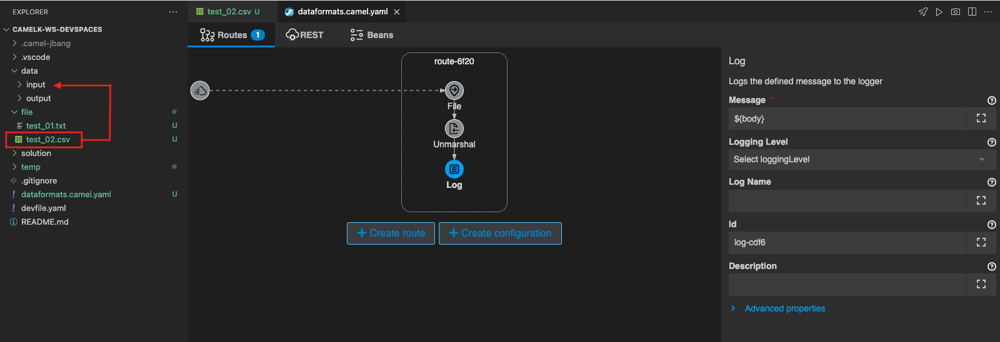
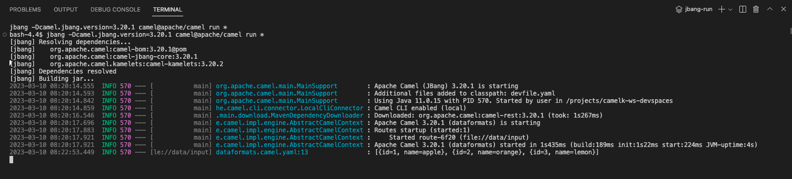
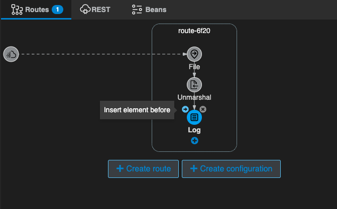
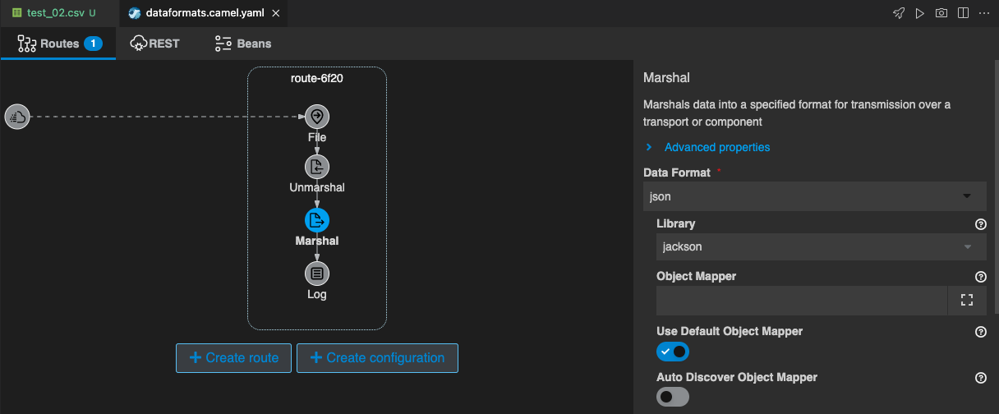
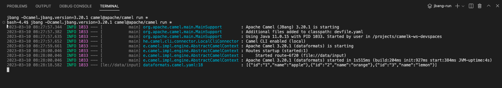

## Data Formats パターン
---

### 1. 目的

[Marshal](https://camel.apache.org/components/{{ CAMEL_VERSION }}/eips/marshal-eip.html){:target="_blank"} と [Unmarshal](https://camel.apache.org/components/{{ CAMEL_VERSION }}/eips/unmarshal-eip.html#){:target="_blank"} を使用して、Camel K のデータ変換機能の使用方法を理解する事を目的とします。

* **Marshal** - Message の Body の Javaオブジェクトをバイナリやテキスト形式に変換します。
* **Unmarshal** - Message の Body の バイナリやテキスト形式のデータをJavaオブジェクトに変換します。

Apache Camel が提供する Data Format については[こちら](https://camel.apache.org/components/{{ CAMEL_VERSION }}/dataformats/index.html){:target="_blank"}を参照してください。

---

### 2. CSVファイルを Unmarshal でJavaオブジェクトに変換する

OpenShift DevSpaces 左のエクスプローラー上で、右クリックをして、メニューから `Karavan: Create Integration` を選択し、`dataformats` と入力して Enter を押してください。`dataformats.camel.yaml` という名前のファイルが作成されて、Karavan Designer のGUIが開きます。

まず、CSVファイルを取得する処理を作成します。
上部の `Create route` をクリックして、Route を作成しましょう。

`components` タブから `File` を探して選択をしてください。
右上のテキストボックスに `File` と入力をすると、絞り込みができます。

{:width="800px"}

Route の source として、File コンポーネントが配置されます。
Route の File シンボルをクリックすると、右側にプロパティが表示されますので、確認してください。

Parameters は、以下を入力してください。

* **Directory Name**: data/input

> 前章の [Fileコンポーネント]({{ HOSTNAME_SUFFIX }}/workshop/camel-k/lab/file-component){:target="_blank"} で `data/input` フォルダを作成していない場合は、ワークスペースのルートフォルダ直下に、`data` フォルダを作成し、さらにdata フォルダの配下に、`input` フォルダを作成してください。

{:width="1200px"}

テスト用のテキストファイルは、`file` フォルダに `test_02.csv` というファイルが用意されていますので、それを使用しましょう。

ファイルの中身は、

<pre>
  id,name
  1,apple
  2,orange
  3,lemon
</pre>

というテキストが格納されています。

{:width="600px"}

では、取得するファイルの中身を変換していきます。
まず、オブジェクトに変換するために、`Unmarshal` を使用します。

Route にマウスカーソルを持っていくと、File シンボルの下に小さな＋ボタンが現れますので、それをクリックし、`Transformation` のタブから `Unmarshal` を探して選択をしてください。

{:width="800px"}

`Unmarshal` のシンボルが File に続いて配置されます。

Parameters は、以下のように設定をしてください。
他の項目は、デフォルトのままで構いません。

* **Data Format**: csv
* **Delimiter**: , (カンマ)
* **Use Maps**: True

{:width="1200px"}

{:width="1200px"}

データ変換後の Body を 確認するための `Log` を追加します。
Unmarshal シンボルの下の＋ボタンをクリックし、`Routing` のタブから `Log` を探して選択をしてください。

{:width="800px"}

Unmarshalで変換した内容を表示するには、Log プロパティ の `Message` に `${body}` と入力をしてください。

それでは、実際に動かしてみます。
右上の ロケットのアイコン のボタンを押してください。

ターミナルが開き、作成したインテグレーションが JBang を通して実行されます。
特にエラーなく実行されたら、左のエクスプローラー上で、`file/test_02.csv` を右クリックして、`Copy` し、`data/input` フォルダの中に `Paste` して、ファイルを指定のフォルダに格納してください。

{:width="1200px"}

ファイルが所定のフォルダに格納されると、インテグレーションが実行されて、コンソールに Unmarshal で変換をした後の Log が表示されます。
（インプットのファイルは、`data/input` 配下に `.camel` フォルダが作成され、そちらに移動します）

CSV Data Format で Unmarshal したデータは、JavaのList型になります。

{:width="1200px"}

Log の確認ができたら、`Ctrl+C` もしくは、ターミナル右上のゴミ箱のアイコンをクリックして、終了してください。

---

### 3. Marshal でJSON形式のテキストに変換する

先ほど作成した `dataformat.camel.yaml` に、JSON形式のテキストに変換する処理を追加します。

Log シンボルにマウスカーソルを持っていくと、左上に小さく `→` ボタンが表示されますので、クリックします。

{:width="600px"}

続いて、`Transformation` タブから `Marshal` を探して選択をしてください。
右上のテキストボックスに `Marshal` と入力をすると、絞り込みができます。

{:width="800px"}

これで、`Unmarshal` と `Log` の間に、`Marshal` が追加されました。

`Marshal` のシンボルをクリックすると、右側にプロパティが表示されますので、
Parameters 項目に、以下の内容を設定してください。
他の項目は、デフォルトのままで構いません。

* **Data Format**: json
* **Library**: jackson

{:width="1200px"}

それでは、もう一度実行をします。
右上の ロケットのアイコン のボタンを押してください。

ターミナルが開き、作成したインテグレーションが JBang を通して実行されます。
特にエラーなく実行されたら、もう一度、 左のエクスプローラー上で、`file/test_02.csv` を右クリックして、`Copy` し、`data/input` フォルダの中に `Paste` して、ファイルを指定のフォルダに格納してください。

ファイルが所定のフォルダに格納されると、インテグレーションが実行されて、コンソールに Marshal で変換をした後の Log が表示されます。
（インプットのファイルは、`data/input` 配下に `.camel` フォルダが作成され、そちらに移動します）

JSON Data Format で Marshal したデータは、JSON形式のテキストになります。

{:width="1200px"}

Logの確認後、`Ctrl+C` もしくは、ターミナル右上のゴミ箱のアイコンをクリックして、終了してください。
また、作成した `dataformats.camel.yaml` を `temp` フォルダに移動をしておいてください。 