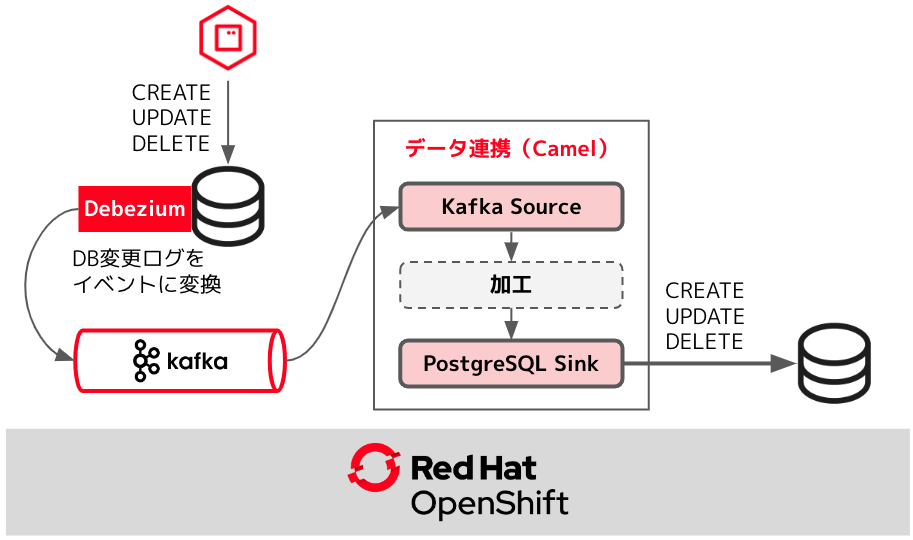
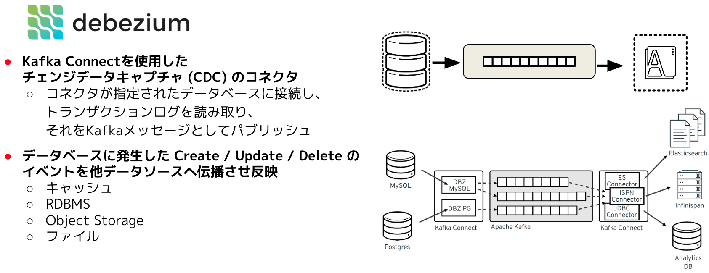
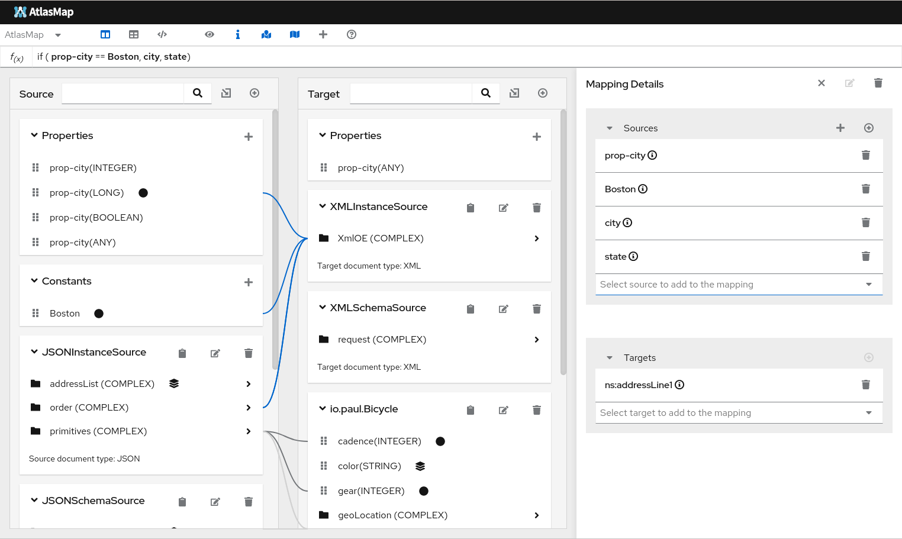

## Camel/Kafka/Debezium を使ったDBの同期
---

### 1. 目的

**Camel/Kafka/Debezium** を使用して、データベース間の同期を行う仕組みを構築します。

{:width="600px"}

#### Debezium について

[Debezium](https://debezium.io/){:target="_blank"} は **Kafka Connect** の仕組みを使用したチェンジデータキャプチャの基盤となる製品です。
データベースに発生した更新イベントをキャプチャして、その更新イベントを **Kafka** のトピックにメッセージとして送信することによって、
その変更内容を **Kafka** に接続している他のシステムに、ニアリアルタイムに連携させることができるようになります。

{:width="1200px"}

#### AtlasMap について

[AtlasMap](https://debezium.io/){:target="_blank"} データマッピングソリューションです。
データマッピングというのは、あるサービスと別のサービス（またはデータベースなど）を接続するときに、どの項目をどの項目に移送するのか、または編集を施すのか、といった作業のことです。
AtlasMap Data Mapper UI キャンバスを使用してデータ マッピングを設計し、ランタイム エンジンを介してそのデータ マッピングを実行することができます。
[camel-atlasmap](https://camel.apache.org/components/{{ CAMEL_VERSION }}/atlasmap-component.html){:target="_blank"} コンポーネントを使用して、Apache Camel ルートの一部としてデータ マッピングを実行することもできます。

{:width="1200px"}

※ 現時点においては、**camel-atlasmap** は Red Hatのサポートではなく、コミュニティサポートです。

#### このセクションで作成する内容

---

### 2. Placeholder

---

### 参考リンク

* [Red Hat build of Debezium](https://access.redhat.com/documentation/en-us/red_hat_build_of_debezium){:target="_blank"}
* [AtlasMap](https://www.atlasmap.io/){:target="_blank"}