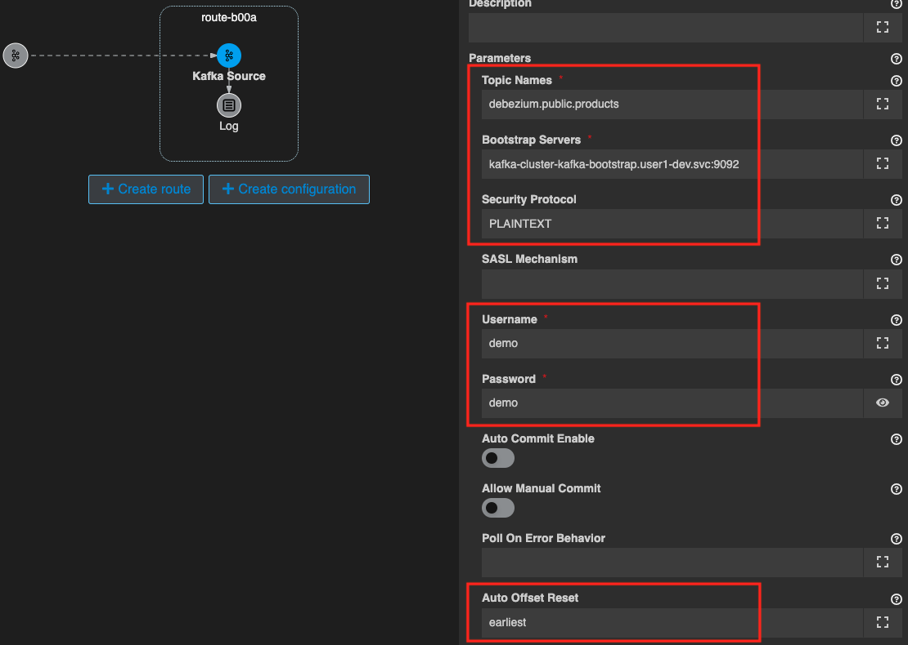
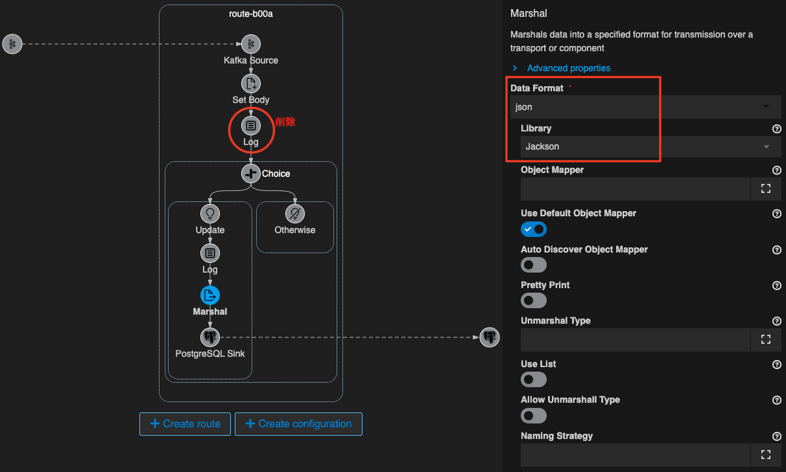
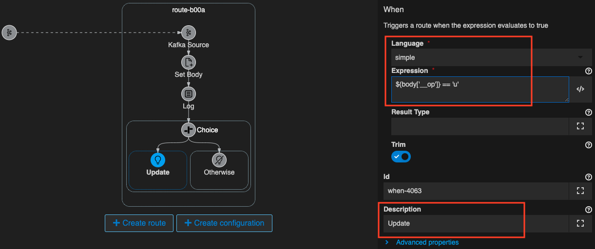
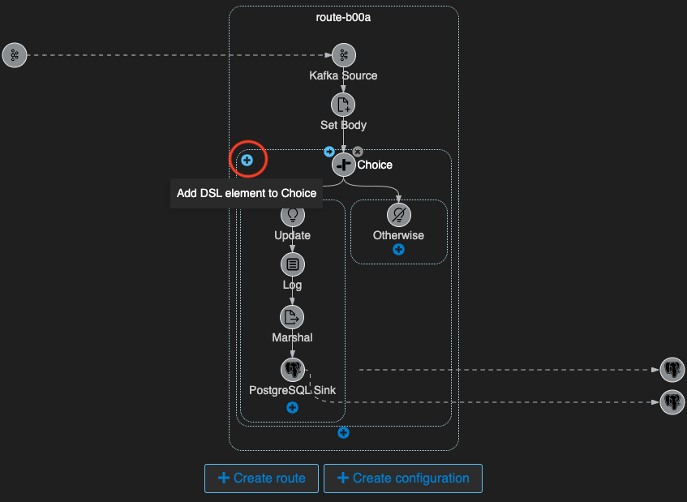

## Camel/Kafka/Debezium を使ったDBの同期
---

### 1. 目的

**Camel/Kafka/Debezium** を使用して、データベース間の同期を行う仕組みを構築します。

{:width="600px"}

#### Debezium について

[Debezium](https://debezium.io/){:target="_blank"} は **Kafka Connect** の仕組みを使用したチェンジデータキャプチャの基盤となる製品です。
データベースに発生した更新イベントをキャプチャして、その更新イベントを **Kafka** のトピックにメッセージとして送信することによって、
その変更内容を **Kafka** に接続している他のシステムに、ニアリアルタイムに連携させることができるようになります。

{:width="800px"}

#### AtlasMap について

[AtlasMap](https://debezium.io/){:target="_blank"} はデータマッピングソリューションです。
データマッピングというのは、あるサービスと別のサービス（またはデータベースなど）を接続するときに、どの項目をどの項目に移送するのか、または編集を施すのか、といった作業のことです。
AtlasMap Data Mapper UI キャンバスを使用してデータマッピングを設計し、ランタイム エンジンを介してそのデータマッピングを実行することができます。
[camel-atlasmap](https://camel.apache.org/components/{{ CAMEL_VERSION }}/atlasmap-component.html){:target="_blank"} コンポーネントを使用して、Apache Camel ルートの一部としてデータ マッピングを実行することもできます。

{:width="1200px"}

※ 現時点においては、**camel-atlasmap** は Red Hatのサポートではなく、コミュニティサポートです。

#### このセクションで作成する内容

* 以下のコンポーネントは既に用意されています
  * 同期元、同期先のPostgreSQL
    * postgresql
    * postgresql-replica
  * 同期元のPostgreSQLの変更ログをキャプチャするDebezium
* 実装する Camelルート
  * DBイベントを受信する Kafka Source
  * データマッピングで必要な項目を抽出
  * CREATE/DELETE/UPDATE で処理を分岐して、同期先の PostgreSQL を操作

{:width="1200px"}

---

### 2. Debezium からのログを受信する

前章の [PostgresSQL との連携]({{ HOSTNAME_SUFFIX }}/workshop/camel-k/lab/postgresql-sink){:target="_blank"} で 使用したデータベースは、`Debezium` にて変更ログをキャプチャし、Kafkaイベントに変換するようになっています。

[Kafdrop](http://{{ KAFDROP_URL }}){:target="_blank"} というツールで、Kafka トピックに送信されたメッセージの内容を確認することができます。

こちらのリンクから、[debezium.public.products](http://{{ KAFDROP_URL }}/topic/debezium.public.products/messages?partition=0&offset=0&count=100&keyFormat=DEFAULT&format=DEFAULT){:target="_blank"} の内容を確認できます。アクセスして確認してみてください。

{:width="1200px"}

トピックにはメッセージが4件入っていると思います。
一番下のメッセージが、前章の最後に追加したレコードの内容に対応しています。

~~~
{
   "schema": {
      "type": "struct",
      "fields": [
         {
            "type": "int32",
            "optional": false,
            "default": 0,
            "field": "id"
         },
         {
            "type": "string",
            "optional": true,
            "field": "name"
         },
         {
            "type": "string",
            "optional": true,
            "field": "__op"
         },
         {
            "type": "string",
            "optional": true,
            "field": "__table"
         },
         {
            "type": "int64",
            "optional": true,
            "field": "__lsn"
         },
         {
            "type": "int64",
            "optional": true,
            "field": "__source_ts_ms"
         },
         {
            "type": "string",
            "optional": true,
            "field": "__deleted"
         }
      ],
      "optional": false,
      "name": "debezium.public.products.Value"
   },
   "payload": {
      "id": 4,
      "name": "melon",
      "__op": "c",
      "__table": "products",
      "__lsn": 23000152,
      "__source_ts_ms": 1682590725891,
      "__deleted": "false"
   }
}
~~~

`fields` にトピックの中の項目の属性情報があり、`payload` の中に実際の値が格納されています。
項目名の先頭に `__` がある項目は、変更イベントのメタデータです。

* **__op**: イベントが生成される原因となった操作
  * c: CREATE
  * r: READ
  * u: UPDATE
  * d: DELETE
* **__table**: 変更イベントが発生したテーブル名
* **__lsn**: Log Sequence Number
* **__source_ts_ms**: イベントのタイムスタンプ
* **__deleted**: 削除されたレコードかどうかを識別

それでは、Kafka からメッセージを受信する処理を作成していきます。 

OpenShift DevSpaces 左のエクスプローラー上で、右クリックをして、メニューから `Karavan: Create Integration` を選択し、`dbsync` と入力して Enter を押してください。`dbsync.camel.yaml` という名前のファイルが作成されて、Karavan Designer のGUIが開きます。

続いて、Karavan Designer のGUIが開いたら、上部の `Create route` をクリックして、Route を作成しましょう。

`Kamelets` タブから `Kafka Source` を探して選択をしてください。
右上のテキストボックスに `Kafka Source` と入力をすると、絞り込みができます。

{:width="800px"}

Route の source として、Kafka Source コンポーネントが配置されます。
Kafka Source シンボルをクリックすると、右側にプロパティが表示されますので、確認してください。

Parameters は、以下を入力してください。

* **Topic Names**: debezium.public.products
* **Bootstrap Servers**: kafka-cluster-kafka-bootstrap.{{ OPENSHIFT_USER }}-dev.svc:9092
* **Security Protocol**: PLAINTEXT
* **Username**: demo
* **Password**: demo
* **Auto Offset Reset**: earliest
  * `latest`: 新しいメッセージから受信 （未指定の場合 latest になります）
  * `earliest`: 最初のメッセージに遡って受信

続いて、受信した Kafka メッセージを確認するための Log を出力しておきます。

`Kafka Source` シンボルの下に小さな＋ボタンが現れますので、それをクリックし、`Routing` のタブから `Log` を探して選択をしてください。

Log の Messege は、`${body}` と入力をしておきます。

{:width="1200px"}

それでは、実際に動かしてみます。
右上の ロケットのアイコン のボタンを押してください。

ターミナルが開き、作成したインテグレーションが JBang を通して実行されます。
特にエラーなく実行されたら、ターミナルにKafkaへの接続情報が表示されます。
その後 Kafka から受信したメッセージの内容を Log として表示します。

{:width="1200px"}

Logの確認後、`Ctrl+C` もしくは、ターミナル右上のゴミ箱のアイコンをクリックして、終了してください。

---

### 3. AtlasMap でデータマッピングをする

Kafka から受信した Debezium のDB変更イベントから、必要なデータを抽出していきます。

[AtlasMap WebUI](http://atlasmap-atlasmap.{{ ROUTE_SUBDOMAIN }}){:target="_blank"} で、データマッピングの設計をすることができます。リンクをクリックして AtlasMap WebUI を開いてください。

{:width="1200px"}

変換前、変換後のjsonやxmlのスキーマ、もしくはインスタンスをインポートして設計を始めることができます。

OpenShift DevSpaces の ワークスペースの `atlasmap/json` フォルダ内に、変換前、後のjson形式のファイルがありますので、一旦これをローカルにダウンロードして保存してください。

* **変換前**: debezium.json
* **変換後**: payload.json

AtlasMap WebUI の左側の `Source` の `Import instance or schema file` をクリックします。

{:width="1200px"}

ローカルにダウンロードした、`debezium.json` を選択してインポートしてください。
Instance か Schema かを聞かれるので、`Instance` を選択します。

{:width="600px"}

今度は、右側の `Target` から、同様にして変換後の `payload.json` をインポートしてください。

{:width="1200px"}

それでは、Target側の各項目に対応する、Source側の同じ名前の項目を探し、ドラッグアンドドロップをして繋げてマッピングします。
Target側の項目は、`payload` の中にあるのでクリックして開いてみてください。

{:width="1200px"}

上の図のように繋いだら、左上のメニューから、`Export all mappings and support files into a catalog (.adm)` をクリックして、ファイルをエクスポートします。名前は任意のもので良いですが、ここでは `atlasmap-mapping.adm` としておきます。

{:width="1200px"}

保存した `admファイル` は、ローカルから OpenShift DevSpaces のワークスペースのルートフォルダに保存しておいてください。（ドラッグアンドドロップでコピーできます）

では、次に Camel ルートに Atlasmap を呼び出すコンポーネントを配置します。

Route の Log シンボルの左上に小さな`→`ボタンが現れますので、それをクリックし、`Components` のタブから `AtlasMap` を探して選択をしてください。
右上のテキストボックスに `AtlasMap` と入力をすると、絞り込みができます。

{:width="800px"}

AtlasMap のシンボルをクリックすると、右側にプロパティが表示されますので、
Parameters 項目に、以下の内容を設定してください。

* **Resource Uri**: file:atlasmap-mapping.adm

> ローカル上で実行する場合は、admファイルの相対パスを記述します。OpenShiftへデプロイする場合には、`file:/etc/camel/resource/<file名>` と入力をしてください。

{:width="1200px"}

それでは、実際に動かしてみます。
右上の ロケットのアイコン のボタンを押してください。

ターミナルが開き、作成したインテグレーションが JBang を通して実行されます。
AtlasMapでデータマッピング実施した後のメッセージが Log に表示されているはずです。

{:width="1200px"}

Logの確認後、`Ctrl+C` もしくは、ターミナル右上のゴミ箱のアイコンをクリックして、終了してください。

---

### 4. 同期先のPostgreSQLを更新する

次に、Camel ルートに同期先のPostgreSQLを更新する処理を作成していきます。
まずは、更新イベントが CREATE/DELETE/UPDATE がどうかを判断する `Choice` コンポーネントを配置します。

* [Choice](https://camel.apache.org/components/{{ CAMEL_VERSION }}/eips/choice-eip.html){:target="_blank"}

#### 4.1 UPDATE処理を作成する

Route にマウスカーソルを持っていくと、Log シンボルの下に小さな＋ボタンが現れますので、それをクリックし、`Routing` タブから `Choice` を探して選択をしてください。
右上のテキストボックスに `Choice` と入力をすると、絞り込みができます。

{:width="800px"}

Log の下に、Choice コンポーネントが配置されます。

{:width="1200px"}

左側の `When` シンボルをクリックすると、右側にプロパティが表示されますので、確認してください。

Parameters は、以下を入力してください。

* **Language**: simple
* **Expression**: ${body.contains("op":"u")}
* **description**: When: UPDATE

これは、`Body` メッセージの中に `"op":"u"` が含まれている場合（UPDATE処理の場合）に、実行されます。

{:width="1200px"}

次に、`When: UPDATE` にマウスカーソルを持っていくと、下に小さな＋ボタンが現れますので、それをクリックし、`Routing` タブから `Log` を探して選択をしてください。

Message は、以下を入力してください。

* **Message**: UPDATE: ${body}

続いて、`Log` の下に、`PostgreSQL Sink` を配置します。`Kamelets` タブから `PostgreSQL Sink` を探して選択をしてください。

{:width="800px"}

PostgreSQL のシンボルをクリックすると、右側にプロパティが表示されますので、
Parameters 項目に、以下の内容を設定してください。

* **Server Name**: postgresql-replica.{{ OPENSHIFT_USER }}-dev.svc.cluster.local
* **Server Port**: 5432
* **Username**: demo
* **Password**: demo
* **Query**: UPDATE products SET name=:#name where id=:#id
* **Database Name**: sampledb

{:width="1200px"}

以上で、UPDATE処理の作成は完了です。

#### 4.2 DELETE処理を作成する

Choice シンボルにマウスカーソルを持っていくと、左上に小さな＋ボタンが現れますので、それをクリックし、`When` を追加してください。

{:width="600px"}

先ほどのUPDATE処理と同様に、`Log` と `PostgreSQL Sink` を追加します。
各シンボルの Parameters 項目に、以下の内容を設定してください。

`When`

* **Language**: simple
* **Expression**: ${body.contains("op":"d")}
* **description**: When: DELETE

`Log`

* **Message**: DELETE: ${body}

`PostgreSQL Sink`

* **Server Name**: postgresql-replica.{{ OPENSHIFT_USER }}-dev.svc.cluster.local
* **Server Port**: 5432
* **Username**: demo
* **Password**: demo
* **Query**: DELETE from products where id=:#id
* **Database Name**: sampledb

{:width="1200px"}

以上で、DELETE処理の作成は完了です。

#### 4.3 CREATE処理を作成する

右側の `Otherwise` にCREATE処理を作成します。

まずは、`Log` と `PostgreSQL Sink` を追加します。
各シンボルの Parameters 項目に、以下の内容を設定してください。

`Otherwise`

* **description**: Otherwise: CREATE

`Log`

* **Message**: CREATE: ${body}

`PostgreSQL Sink`

* **Server Name**: postgresql-replica.{{ OPENSHIFT_USER }}-dev.svc.cluster.local
* **Server Port**: 5432
* **Username**: demo
* **Password**: demo
* **Query**: INSERT INTO products (id, name) VALUES (:#id, :#name)
* **Database Name**: sampledb

{:width="1200px"}

以上で、CREATE処理の作成は完了です。

---

### 5. Camel/Kafka/Debezium を使ったDBの同期の実行

作成したDB同期の処理を実行してみましょう。
まず、それぞれのDBのテーブルの状態を確認していきます。
下記のコマンドを実行してください。

* 同期元DBの確認: `oc rsh -n {{ OPENSHIFT_USER }}-dev dc/postgresql psql -U demo -d sampledb -c "SELECT * FROM products;"`
* 同期先DBの確認: `oc rsh -n {{ OPENSHIFT_USER }}-dev dc/postgresql-replica psql -U demo -d sampledb -c "SELECT * FROM products;"`

{:width="800px"}

それでは、実際に動かしてみます。
右上の ロケットのアイコン のボタンを押してください。

ターミナルが開き、作成したインテグレーションが JBang を通して実行されます。
ターミナルに、同期先のDBに対してCREATE処理が実行されたことを示す Log が表示されているはずです。

{:width="1200px"}

別のターミナルを開き、同期先のDBの内容を確認してみてください。

* 同期先DBの確認: `oc rsh -n {{ OPENSHIFT_USER }}-dev dc/postgresql-replica psql -U demo -d sampledb -c "SELECT * FROM products;"`

同期元と同じレコードが追加されています。

{:width="800px"}

同期元DBに対して、CREATE\UPDATE\DELETEの操作をして、同期先DBに反映されることを確認してみてください。

* 同期元DB CREATE: `oc rsh -n {{ OPENSHIFT_USER }}-dev dc/postgresql psql -U demo -d sampledb -c "INSERT INTO products (name) VALUES ('strawberry');"`
* 同期元DB DELETE: `oc rsh -n {{ OPENSHIFT_USER }}-dev dc/postgresql psql -U demo -d sampledb -c "DELETE from products where id=2;"`
* 同期元DB UPDATE: `oc rsh -n {{ OPENSHIFT_USER }}-dev dc/postgresql psql -U demo -d sampledb -c "UPDATE products SET name=pineapple where id=1;"`

実行後、ターミナルにそれぞれの処理が実行されたことを示す Log が表示されます。

{:width="1200px"}

同期元、同期先のDBの内容を確認して、同期ができていることを確認してください。

* 同期元DBの確認: `oc rsh -n {{ OPENSHIFT_USER }}-dev dc/postgresql psql -U demo -d sampledb -c "SELECT * FROM products;"`
* 同期先DBの確認: `oc rsh -n {{ OPENSHIFT_USER }}-dev dc/postgresql-replica psql -U demo -d sampledb -c "SELECT * FROM products;"`

{:width="800px"}

Logの確認後、`Ctrl+C` もしくは、ターミナル右上のゴミ箱のアイコンをクリックして、終了してください。

---

### 参考リンク

* [Red Hat build of Debezium](https://access.redhat.com/documentation/en-us/red_hat_build_of_debezium){:target="_blank"}
* [AtlasMap](https://www.atlasmap.io/){:target="_blank"}