## エラー処理の実装
---

### 1. 目的

Camelの **Route Configration** を使用してエラー処理実装を行い、Camelのエラー処理機能を理解する事を目的とします。

* 参考: [Route Configration](https://camel.apache.org/manual/route-configuration.html#_route_configuration_in_yaml)

---

### 2. ダミーのエラーを発生させる

まずはダミーのエラーを発生させる処理を作成していきます。 

OpenShift DevSpaces 左のエクスプローラー上で、右クリックをして、メニューから `Karavan: Create Integration` を選択し、`error-handling` と入力して Enter を押してください。`error-handling.camel.yaml` という名前のファイルが作成されて、Karavan Designer のGUIが開きます。

続いて、Karavan Designer のGUIが開いたら、上部の `Create route` をクリックして、Route を作成しましょう。

`Components` タブから `REST` を探して選択をしてください。
右上のテキストボックスに `REST` と入力をすると、絞り込みができます。

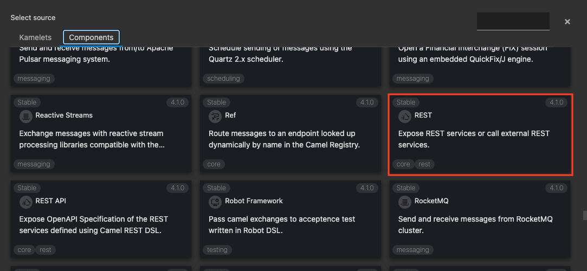
{:width="800px"}

Route の source として、REST コンポーネントが配置されます。
REST シンボルをクリックすると、右側にプロパティが表示されますので、確認してください。

Parameters は、以下を入力してください。

* **Method**: get
* **Path**: dummy

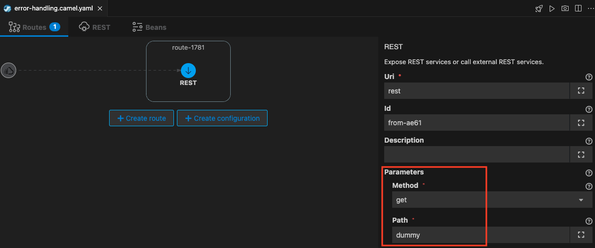
{:width="1200px"}

続いて、`Throw Exception` を用いてダミーのエラーを発生させる仕組みを実装します。 

`REST` シンボルの下に小さな＋ボタンが現れますので、それをクリックし、`Integration Patterns -> error` のタブから `Throw Exception` を探して選択をしてください。

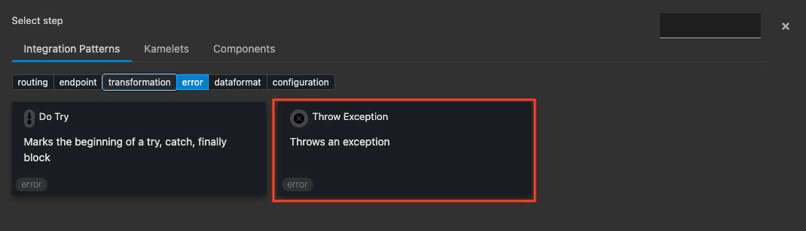
{:width="800px"}

Throw Exception の Parameters は、以下を入力してください。

* **Message**: dummy
* **Exception Type**: java.lang.Exception

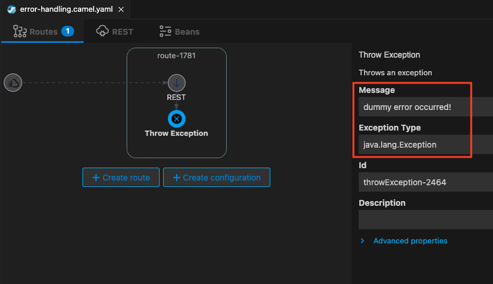
{:width="1200px"}

それでは、実際に動かしてみます。
右上の ロケットのアイコン のボタンを押してください。

ターミナルが開き、作成したインテグレーションが JBang を通して実行され、ターミナルの右下に以下のようなポップアップ画面が表示されますので、`yes` を選択してください。

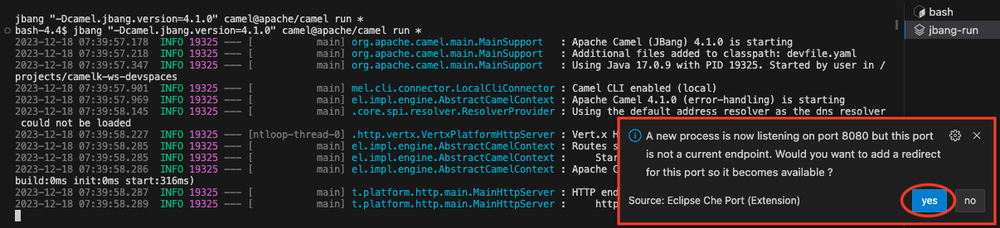
{:width="1200px"}

続いて、以下のようなポップアップ画面が表示されます。
`Open In New Tub` を選択します。

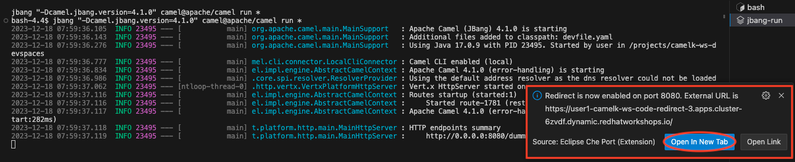
{:width="1200px"}

ブラウザの新しいタブでページが開きますので、
URLの末尾に `/dummy` を追加してアクセスをします。

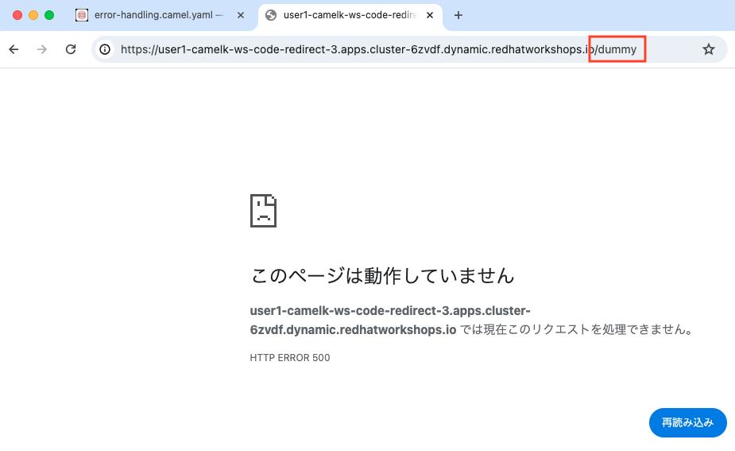
{:width="1200px"}

OpenShift DevSpaces の ターミナルに戻ります。
以下のようなスタックトレースが表示されていること、およびDefaultErrorHandlerが処理を行っていることを確認します。

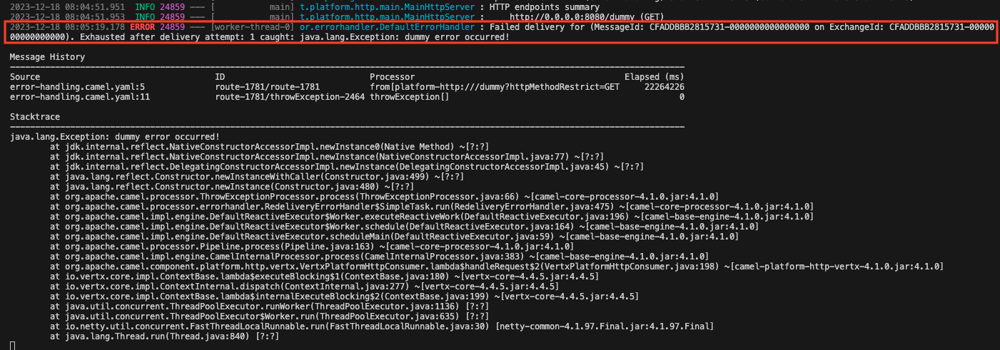
{:width="1200px"}

確認後、`Ctrl+C` もしくは、ターミナル右上のゴミ箱のアイコンをクリックして、終了してください。

---

### 3. Route Configration を使用したエラー処理を実装する

Karavan Designer で、`Create configration` をクリックします。

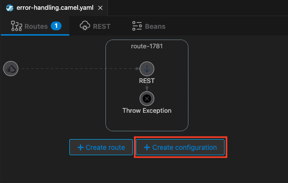
{:width="800px"}

新しい `Route Configration` が作成されます。`Id` に `dummyError` を設定してください。

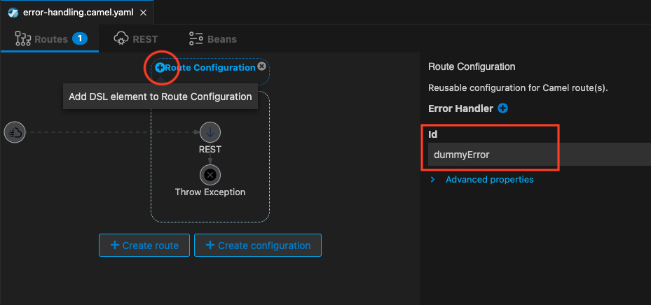
{:width="1200px"}

次に、作成した Route Configration 上にマウスカーソルを移動し、
左に表示される `+` をクリックしてください。

`Integration Patterns -> error` タブから、`On Exception` を選択します。

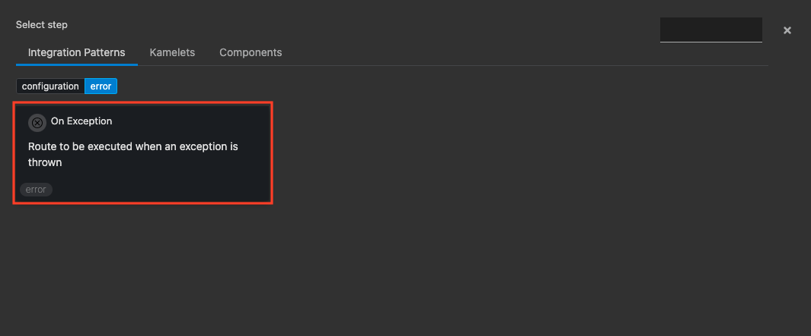
{:width="800px"}

On Exception の Parameter については、以下のように入力をしてください。うち、`Exception` については、テキストボックスに入力後、右側の `+` をクリックすることで格納されることに注意をしてください。（複数のExceptionを設定することが可能になっています）

* Exception: `java.lang.Exception`
* Handled:
  * Language: `constant`
  * Expression: `true`

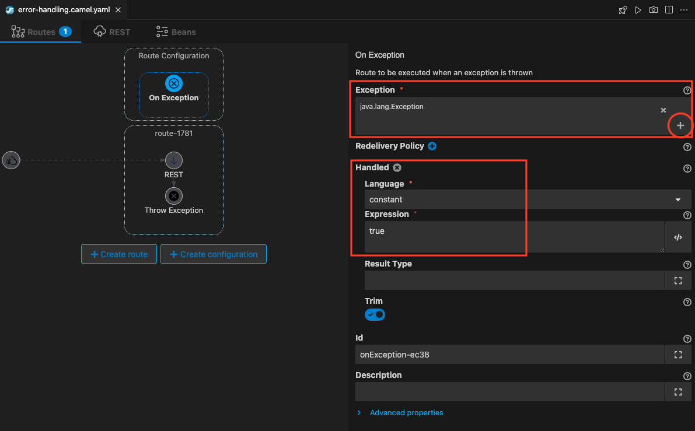
{:width="1200px"}

次に、エラー発生時の処理を実装します。
今回は、Body に スタックトレースの内容を設定し、ブラウザ側に表示させるようにします。

配置した On Exception の下の `+` をクリックし、`Integration Patterns -> transformation` のタブから、`Set Body` を選択してください。

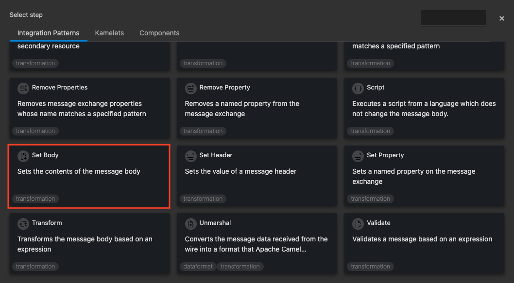
{:width="800px"}

Set Body の Parameter については、以下のように入力をしてください。

* Language: `simple`
* Expression: `${exception.stacktrace}`

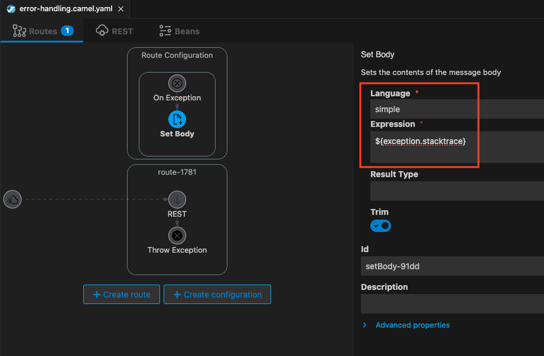
{:width="1200px"}

最後に、ダミーのエラー処理を発生させるCamel Route に、Route Configration を設定します。

Camel Route をクリックして、`Route Configration Id` に、`dummyError` を入力してください。

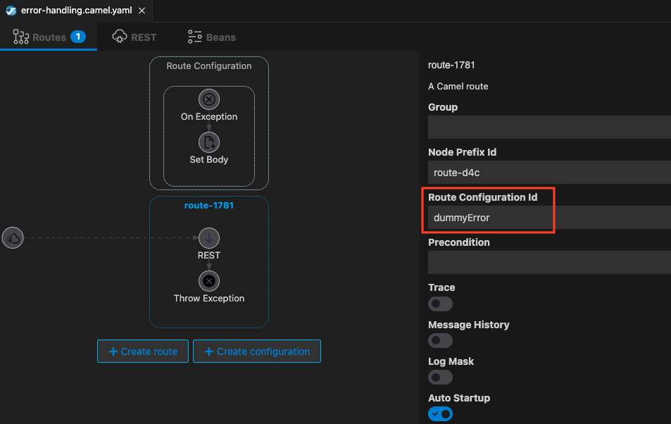
{:width="1200px"}

それでは、実際に動かしてみます。
右上の ロケットのアイコン のボタンを押してください。

ターミナルが開き、作成したインテグレーションが JBang を通して実行されます。
先ほどと同じようにポップアップ画面が表示されますので、`yes` を選択し、ブラウザで開いてください。

開いたURLの末尾に `/dummy` を追加してアクセスします。
ブラウザに以下のようなスタックトレースが表示されていればOKです。

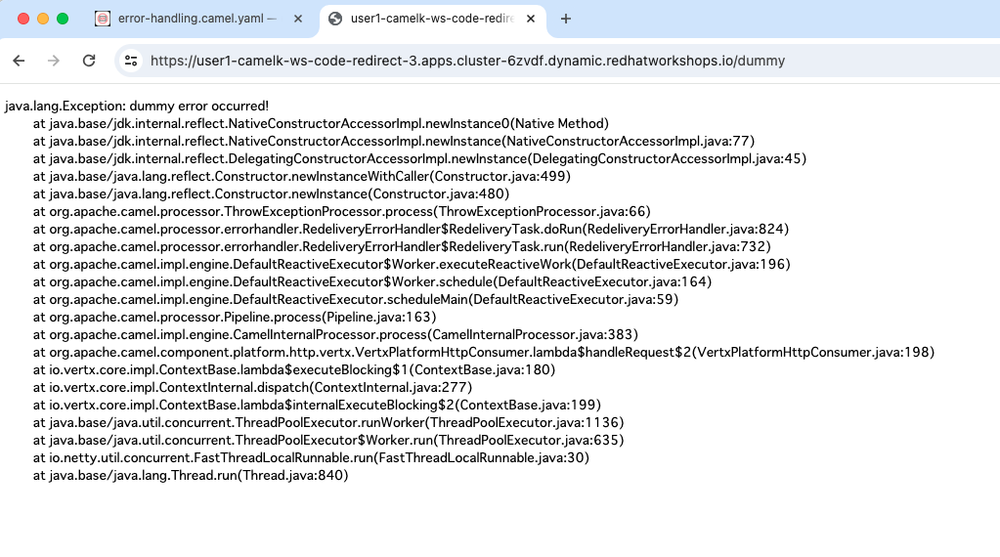
{:width="1200px"}

確認後、`Ctrl+C` もしくは、ターミナル右上のゴミ箱のアイコンをクリックして、終了してください。

---

### 参考リンク

* [Route Configration](https://camel.apache.org/manual/route-configuration.html#_route_configuration_in_yaml)