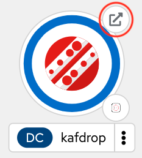

## Kafka との連携
---

### 1. 目的

Kamelet の **Kafka Source**, **Kafka Sink** を使用して、Camel K と Kafka との連携の方法について理解していただきます。

* [Kafka Source](https://camel.apache.org/camel-kamelets/{{ KAMELETS_VERSION }}/kafka-source.html){:target="_blank"}
* [Kafka Sink](https://camel.apache.org/camel-kamelets/{{ KAMELETS_VERSION }}/kafka-sink.html){:target="_blank"}

Kafka に対してランダムなメッセージを発信するアプリと、Kafkaからメッセージを受信して表示する WebUI が、OpenShift上にあらかじめデプロイされています。
ここでは Camel を使用して、アプリから発信されるメッセージを、WebUIに連携していきます。


{:width="800px"}

---

### 2. Kafka Source を使用して、Kafka トピックからメッセージを受信する

こちらのリンクから、OpenShift Web Console の [Topology]({{ CONSOLE_URL }}/topology/ns/{{ OPENSHIFT_USER }}-dev?view=graph) ビュー にアクセスをしてください。


{:width="200px"}

`Emitter` というアプリが、Kafka の `incoming-topic` というトピックに対して、10秒間毎に以下のような情報を持ったメッセージをランダムに発信をしています。

```
{
  "orderType": "E", 
  "orderItemName": "Tart Lemon", 
  "quantity": 143, 
  "price": 3.68, 
  "shipmentAddress": "329-2476 Ut Ave", 
  "zipCode": "25113"
}
```


{:width="200px"}

[Kafdrop](https://{{ KAFDROP_URL }}) というツールで、Kafka トピックに送信されたメッセージの内容を確認することができます。

 こちらのリンクから、[`incoming-topic`](https://{{ KAFDROP_URL }}/topic/incoming-topic/messages?partition=0&offset=0&count=100&keyFormatDEFAULT=&format=DEFAULT) の内容を確認できます。アクセスして確認してみてください。


{:width="1200px"}

それでは、Kafka からメッセージを受信する処理を作成していきます。 

OpenShift DevSpaces 左のエクスプローラー上で、右クリックをして、メニューから `Karavan: Create Integration` を選択し、`kafka` と入力して Enter を押してください。`kafka.camel.yaml` という名前のファイルが作成されて、Karavan Designer のGUIが開きます。

続いて、Karavan Designer のGUIが開いたら、上部の `Create route` をクリックして、Route を作成しましょう。

`Kamelets` タブから `Kafka Not Secured Source` を探して選択をしてください。
右上のテキストボックスに `Kafka Not Secured Source` と入力をすると、絞り込みができます。


{:width="800px"}

Route の source として、Kafka Not Secured Source コンポーネントが配置されます。
Kafka Not Secured Source シンボルをクリックすると、右側にプロパティが表示されますので、確認してください。

Parameters は、以下を入力してください。

* **Topic Names**: incoming-topic
* **Bootstrap Servers**: kafka-cluster-kafka-bootstrap.{{ OPENSHIFT_USER }}-dev.svc:9092
* **Auto Offset Reset**: latest
  * `latest`: 新しいメッセージから受信 （未指定の場合 latest になります）
  * `earliest`: 最初のメッセージに遡って受信

今回は、最初からの全てのメッセージを受信するため、`Auto Offset Reset` には `latest` を指定してください。

続いて、受信した Kafka メッセージを確認するための Log を出力しておきます。

`Kafka Not Secured Source` シンボルの下に小さな＋ボタンが現れますので、それをクリックし、`Routing` のタブから `Log` を探して選択をしてください。

Log の Messege は、`${body}` と入力をしておきます。


{:width="1200px"}

それでは、実際に動かしてみます。
右上の ロケットのアイコン のボタンを押してください。

ターミナルが開き、作成したインテグレーションが JBang を通して実行されます。
特にエラーなく実行されたら、ターミナルにKafkaへの接続情報が表示されます。
その後10秒ごとに Emitter からメッセージが発信されると、そのメッセージを受信して内容を Log として表示します。


〜中略〜


Logの確認後、`Ctrl+C` もしくは、ターミナル右上のゴミ箱のアイコンをクリックして、終了してください。

### 2. Kafka Sink を使用して、Kafka トピックにメッセージを送信する


ここでは、[Split パターン]({{ HOSTNAME_SUFFIX }}/workshop/camel-k/lab/split-eip)で作成したインテグレーションに、Kafkaトピックへのメッセージの送信処理を追加していきます。
まだ [Split パターン]({{ HOSTNAME_SUFFIX }}/workshop/camel-k/lab/split-eip) を実施していない場合は、そちらを先に実施してください。

VSCODE に戻り、左のエクスプローラー上で、`split.yam` を複製し、任意のファイル名に変更してください。（ここでは、kafka-sink.yaml としておきます）


{:width="800px"}

それでは、Kafka トピックにメッセージを送信する処理を追加していきます。
Log シンボルにマウスカーソルを持っていくと、左上に小さく `→` ボタンが表示されますので、クリックします。

続いて、`Kamelets` タブから `Kafka Sink` を探して選択をしてください。
右上のテキストボックスに `Kafka Sink` と入力をすると、絞り込みができます。


{:width="600px"}

これで、`Split` と `Log` の間に、`Kafka Sink` が追加されました。

`Kafka Sink` のシンボルをクリックすると、右側にプロパティが表示されますので、
Parameters 項目に、以下の内容を設定してください。
他の項目は、デフォルトのままで構いません。

* **Topic Names**: RHOSAK で作成した Kafka トピック名
* **Bootstrap Servers**: RHOSAK で作成した Kafka インスタンスの Bootstrap Servers
* **Username**: Service Account の ID
* **Password**: Service Account の Secret


{:width="800px"}

最後に、テスト用のCSVファイルを用意します。
[DataFormatsパターン]({{ HOSTNAME_SUFFIX }}/workshop/camel-k/lab/data-formats) の章で作成した `test.csv` を使用します。
ファイルが無い場合は、左のエクスプローラー上で、右クリックをして、メニューから `新しいファイル` を選択し、`test.csv` を作成します。

ファイルの中身は、

<pre>
  id,name
  1,apple
  2,orange
  3,lemon
</pre>

としてください。

それでは、実際に動かしてみます。

右上の **▷** の実行ボタンを押してください。
（もしくは、左のエクスプローラでファイル名を右クリックして、`Karavan: Run File` を選択してください）

ターミナルが開き、作成したインテグレーションが JBang を通して実行されます。
Kafka に接続ができていれば、ターミナルに以下の様に表示されているはずです。


{:width="800px"}

特にエラーなく実行されたら、`test.csv` を `data/input` フォルダに移動して格納をしてください。
ファイル格納後、以下の様な Log が表示されていればOKです。


{:width="800px"}

では、実際に送信されているかどうかを確認してみましょう。
[RHOSAK](https://console.redhat.com/application-services/streams/kafkas) に戻り、作成した Kafka インスタンスのページを開きます。

`Topics` のタブを選択し、作成したトピック名をクリックしてください。


{:width="800px"}

次に、トピックの詳細ページで `Messages` のタブを選択すると、送信したメッセージが確認できます。


{:width="800px"}

メッセージの確認ができたら、処理を停止してください。

### 4. Kafka Source を使用して、Kafka トピックからメッセージを受信する

今度は、まずは Kafka からメッセージを受信する処理を作成していきます。 

VSCODE 左のエクスプローラー上で、右クリックをして、メニューから `Karavan: Create Integration` を選択し、任意のファイル名で空のインテグレーションを作成をしてください。
（ここでは、kafka-source というファイル名にしておきます。）

Karavan Designer のGUIをが開いたら、上部の `Create new route` をクリックして、Route を作成しましょう。

`Kamelets` タブから `Kafka Source` を探して選択をしてください。
右上のテキストボックスに `Kafka Source` と入力をすると、絞り込みができます。


{:width="600px"}

Route の source として、Kafka Source コンポーネントが配置されます。
Kafka Source シンボルをクリックすると、右側にプロパティが表示されますので、確認してください。

Parameters は、以下を入力してください。

* **Topic Names**: RHOSAK で作成した Kafka トピック名
* **Bootstrap Servers**: RHOSAK で作成した Kafka インスタンスの Bootstrap Servers
* **Username**: Service Account の ID
* **Password**: Service Account の Secret
* **Auto Offset Reset**: earliest
  * `earliest`: 最初のoffsetに自動リセット
  * `latest`: 最新のoffsetに自動リセット （未指定の場合 latest になります）

今回は、先ほど送信した メッセージを受信するため、`Auto Offset Reset` には `earliest` を指定してください。


{:width="800px"}

次に、メッセージが受信できたことを確認するための `Log` を追加します。
Kafka Source シンボルの下の＋ボタンをクリックし、`Routing` のタブから `Log` を探して選択をしてください。

Log プロパティ の `Message` に `Recieved Message:${body}` と入力をしてください。


{:width="800px"}

それでは、実際に動かしてみます。

右上の **▷** の実行ボタンを押してください。
（もしくは、左のエクスプローラでファイル名を右クリックして、`Karavan: Run File` を選択してください）

ターミナルが開き、作成したインテグレーションが JBang を通して実行されます。

Kafka トピックにアクセスできていれば、メッセージを受信して、ターミナルに以下の Log が表示されているはずです。


{:width="800px"}

メッセージの確認ができたら、処理を停止してください。

---

### 参考リンク

* [Red Hat Integration - Kamelets リファレンス](https://access.redhat.com/documentation/ja-jp/red_hat_integration/2022.q4/html/kamelets_reference/kafka-sink)