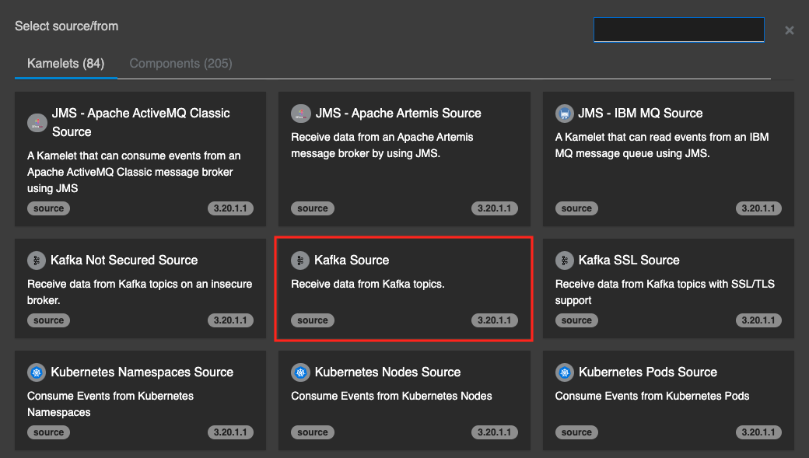
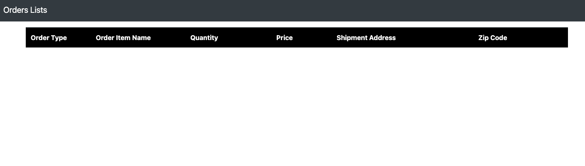
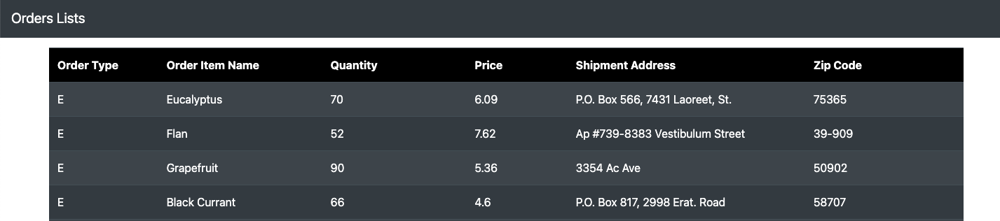

## Kafka との連携
---

### 1. 目的

Kamelet の **Kafka Source**, **Kafka Sink** を使用して、Camel K と Kafka との連携の方法について理解していただきます。

* [Kafka Source](https://camel.apache.org/camel-kamelets/{{ KAMELETS_VERSION }}/kafka-source.html){:target="_blank"}
* [Kafka Sink](https://camel.apache.org/camel-kamelets/{{ KAMELETS_VERSION }}/kafka-sink.html){:target="_blank"}

Kafka に対してランダムなメッセージを発信するアプリと、Kafkaからメッセージを受信して表示する WebUI が、OpenShift上にあらかじめデプロイされています。
ここでは Camel を使用して、アプリから発信されるメッセージを、WebUIに連携していきます。


{:width="800px"}

---

### 2. Kafka Source を使用して、Kafka トピックからメッセージを受信する

こちらのリンクから、OpenShift Web Console の [Topology view]({{ CONSOLE_URL }}/topology/ns/{{ OPENSHIFT_USER }}-dev?view=graph){:target="_blank"} にアクセスをしてください。


{:width="200px"}

`emitter` というアプリが、Kafka の `incoming-topic` というトピックに対して、10秒間毎に以下のような情報を持ったメッセージをランダムに発信をしています。

```
{
  "orderType": "E", 
  "orderItemName": "Tart Lemon", 
  "quantity": 143, 
  "price": 3.68, 
  "shipmentAddress": "329-2476 Ut Ave", 
  "zipCode": "25113"
}
```


{:width="200px"}

[`Kafdrop`](http://{{ KAFDROP_URL }}){:target="_blank"} というツールで、Kafka トピックに送信されたメッセージの内容を確認することができます。

 こちらのリンクから、[incoming-topic](http://{{ KAFDROP_URL }}/topic/incoming-topic/messages?partition=0&offset=0&count=100&keyFormatDEFAULT=&format=DEFAULT){:target="_blank"} の内容を確認できます。アクセスして確認してみてください。


{:width="1200px"}

それでは、Kafka からメッセージを受信する処理を作成していきます。 

OpenShift DevSpaces 左のエクスプローラー上で、右クリックをして、メニューから `Karavan: Create Integration` を選択し、`kafka` と入力して Enter を押してください。`kafka.camel.yaml` という名前のファイルが作成されて、Karavan Designer のGUIが開きます。

続いて、Karavan Designer のGUIが開いたら、上部の `Create route` をクリックして、Route を作成しましょう。

`Kamelets` タブから `Kafka Source` を探して選択をしてください。
右上のテキストボックスに `Kafka Source` と入力をすると、絞り込みができます。


{:width="800px"}

Route の source として、Kafka Source コンポーネントが配置されます。
Kafka Source シンボルをクリックすると、右側にプロパティが表示されますので、確認してください。

Parameters は、以下を入力してください。

* **Topic Names**: incoming-topic
* **Bootstrap Servers**: kafka-cluster-kafka-bootstrap.{{ OPENSHIFT_USER }}-dev.svc:9092
* **Security Protocol**: PLAINTEXT
* **Username**: demo
* **Password**: demo
* **Auto Offset Reset**: latest
  * `latest`: 新しいメッセージから受信 （未指定の場合 latest になります）
  * `earliest`: 最初のメッセージに遡って受信

今回は、新しいメッセージから受信するようにするため、`Auto Offset Reset` には `latest` を指定してください。

続いて、受信した Kafka メッセージを確認するための Log を出力しておきます。

`Kafka Source` シンボルの下に小さな＋ボタンが現れますので、それをクリックし、`Routing` のタブから `Log` を探して選択をしてください。

Log の Messege は、`${body}` と入力をしておきます。


{:width="1200px"}

それでは、実際に動かしてみます。
右上の ロケットのアイコン のボタンを押してください。

ターミナルが開き、作成したインテグレーションが JBang を通して実行されます。
特にエラーなく実行されたら、ターミナルにKafkaへの接続情報が表示されます。
その後10秒ごとに Emitter からメッセージが発信されると、そのメッセージを受信して内容を Log として表示します。


{:width="1200px"}
〜中略〜

{:width="1200px"}

Logの確認後、`Ctrl+C` もしくは、ターミナル右上のゴミ箱のアイコンをクリックして、終了してください。

---

### 3. Kafka Sink を使用して、Kafka トピックにメッセージを送信する

続いて、受信したメッセージを表示する、WebUI へと連携していきます。

WebUI は、`outcoming-topic` という Kafka トピック に送信されたメッセージを受信して、表示をします。

こちらのリンクから、[WebUI](http://{{ WEBUI_URL }}){:target="_blank"} にアクセスすることができます。
もしくは、OpenShift Web Console の [Topology view]({{ CONSOLE_URL }}/topology/ns/{{ OPENSHIFT_USER }}-dev?view=graph){:target="_blank"} にアクセスし、`quarkusapp` の Route URL よりアクセスしてください。


{:width="200px"}

現時点では、`outcoming-topic` にメッセージは発信されていないので、WebUIに表示はされません。


{:width="1200px"}

それでは、先ほど作成した `kafka.camel.yaml` に、`outcoming-topic` へメッセージを発信する処理を追加していきます。

Route にマウスカーソルを持っていくと、Log シンボルの下に小さな＋ボタンが現れますので、それをクリックし、`Kamelets` タブから `Kafka Sink` を探して選択をしてください。
右上のテキストボックスに `Kafka Sink` と入力をすると、絞り込みができます。


{:width="800px"}

Log の下に、Kafka Sink コンポーネントが配置されます。
Kafka Sink シンボルをクリックすると、右側にプロパティが表示されますので、確認してください。

Parameters は、以下を入力してください。

* **Topic Names**: outcoming-topic
* **Bootstrap Servers**: kafka-cluster-kafka-bootstrap.{{ OPENSHIFT_USER }}-dev.svc:9092
* **Security Protocol**: PLAINTEXT
* **Username**: demo
* **Password**: demo


{:width="1200px"}

それでは、実際に動かしてみます。
右上の ロケットのアイコン のボタンを押してください。

ターミナルが開き、作成したインテグレーションが JBang を通して実行されます。
特にエラーなく実行されたら、ターミナルの Log を確認して、Kafka の `incoming-topic` からのメッセージを受信できていることと、WebUI に送信したメッセージが表示されていることを確認してください。


{:width="1200px"}


{:width="1200px"}

確認後、`Ctrl+C` もしくは、ターミナル右上のゴミ箱のアイコンをクリックして、終了してください。
また、作成した `kafka.camel.yaml` を `temp` フォルダに移動をしておいてください。 

---

### 4. 参考リンク

* [Red Hat Integration - Kamelets リファレンス](https://access.redhat.com/documentation/ja-jp/red_hat_integration/2022.q4/html/kamelets_reference/kafka-sink){:target="_blank"}