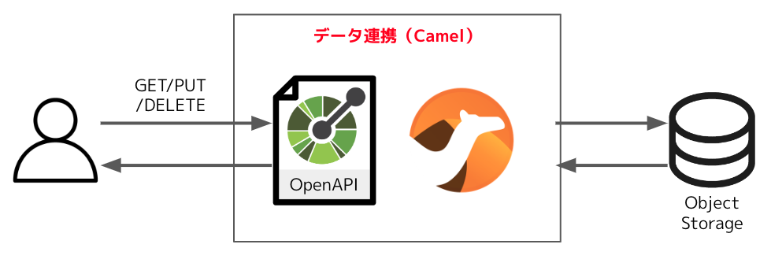
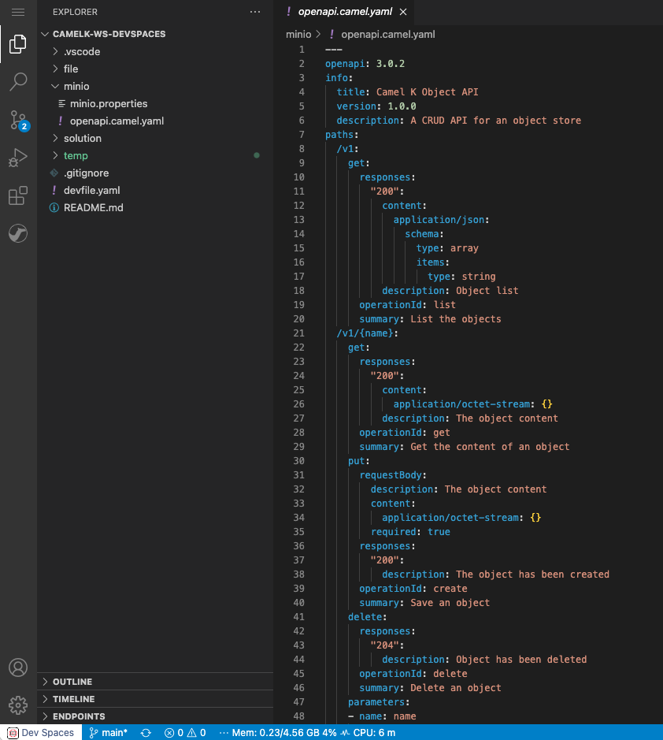
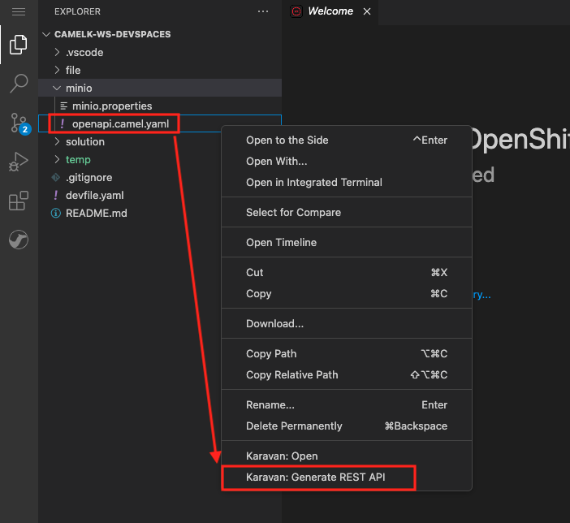
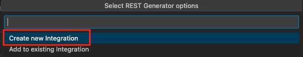
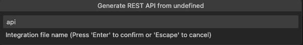
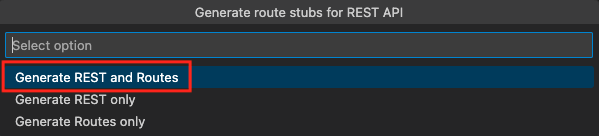
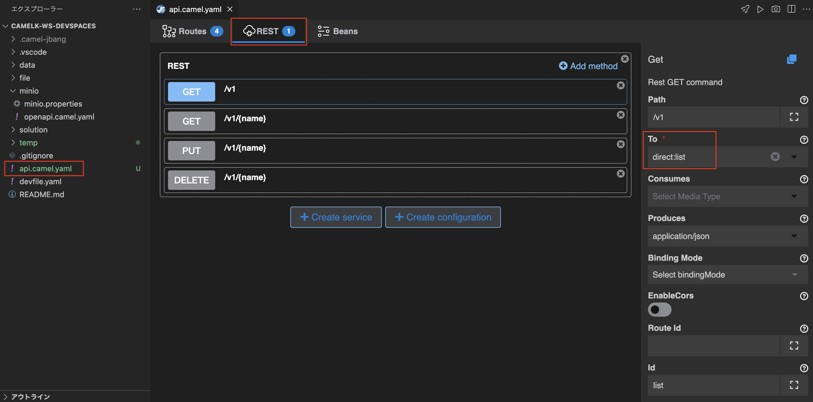
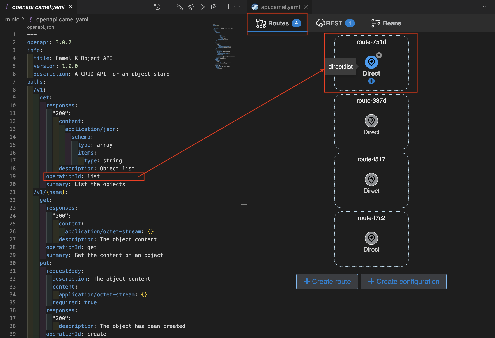

## REST API サービスの実装
---

### 1. 目的

このセクションでは、OpenAPIの定義を用いて、エンドポイントの実装と サーバーレス API としてのデプロイまでを、Camel K のインテグレーションで作成します。


{:width="800px"}

このシナリオでは、APIを使用して、ユーザーがファイルなどの汎用オブジェクトをバックエンドシステムに保存し、それに対するCRUD操作を許可します。

バックエンドは、オープンソースソフトウェアで Amazon S3 互換のオブジェクトストレージである、MinIO を使用していきます。

* **OpenAPI**: https://www.openapis.org/
* **MinIO**: https://min.io/

---

### 2. OpenAPI定義をKaravanにインポートする

ベースになる OpenAPIの定義は、`minio/openapi.camel.yaml` に記述されています。
中身を見て確認をしてみてください。

このAPIを用いて実装したい操作は、以下の内容です。

* **get /v1**: 含まれているオブジェクトの名前の一覧表示
* **get /v1/{name}**: オブジェクトのコンテンツを取得する
* **put /v1/{name}**: 新しいオブジェクトの作成
* **delete /v1/{name}**: オブジェクトの削除


{:width="1200px"}

<!-- ここから: Karavan の バグ修正後に切り替え 

まずは、OpenShift DevSpaces 左のエクスプローラー上で、`minio` フォルダの中に、`openapi.camel.yaml` というファイルがあるので、右クリックをして、`Karavan: Generate REST API` を選択してください。


{:width="800px"}

今回は新規にインテグレーションを作成するので、`Create new Integration` をクリックします。


{:width="600px"}

テキストボックスに `api` と入力して、Enterを押してください。


{:width="600px"}

続いて表示されるポップアップに対して、`Generate REST and Route` をクリックします。


{:width="600px"}

-->

まずは、OpenAPIの定義をインポートして、REST API のエンドポイントと Camel の Route を生成します。ターミナルを開き、下記のコマンドを実行してください。

```
jbang camel@apache/camel generate rest -i minio/openapi.camel.yaml --routes --type=yaml > api.camel.yaml
```

コマンドの実行完了後、`api.camel.yaml` というファイルが作成されますので、右クリックして、`karavan: Open` を選択します。

`REST` のタブをクリックすると、REST API のエンドポイントの情報を確認することができます。
それぞれのプロパティを確認し、OpenAPIの定義と比較してみてください。


{:width="1200px"}

`Route` のタブをクリックすると、REST APIに対応した Camel の Route が、`direct` を source にして作成されています。
OpenAPI定義の `operationId` が、`direct` の URI と対応しています。


{:width="1200px"}

---

### 3. Route の処理を実装する

Camel の [AWS S3 Storage Service](https://camel.apache.org/components/{{ CAMEL_VERSION }}/aws2-s3-component.html){:target="_blank"} コンポーネントを使用して、Amazon S3 互換のオブジェクトストレージである、MinIO に対して操作をする処理を実装していきます。

#### 3.1 含まれているオブジェクトの名前の一覧表示


---

### 5. 参考リンク

* **製品ドキュメント AWS S3 Storage Service**: https://access.redhat.com/documentation/it-it/red_hat_build_of_apache_camel_for_spring_boot/3.14/html/camel_spring_boot_reference/csb-camel-aws2-s3-component-starter
