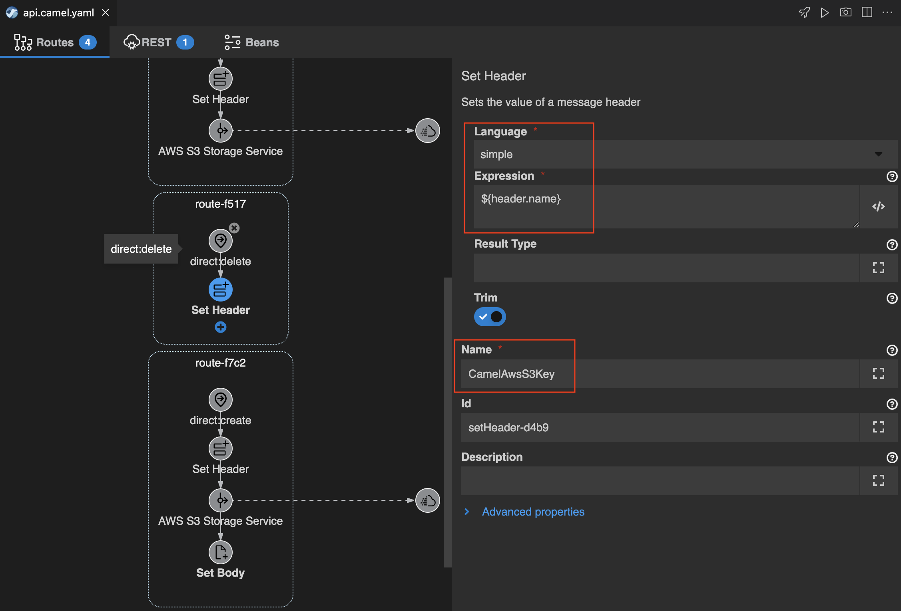
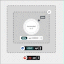

## REST API サービスの実装
---

### 1. 目的

このセクションでは、OpenAPIの定義を用いて、エンドポイントの実装と サーバーレス API としてのデプロイまでを、Camel K のインテグレーションで作成します。


{:width="800px"}

このシナリオでは、APIを使用して、ユーザーがファイルなどの汎用オブジェクトをバックエンドシステムに保存し、それに対するCRUD操作を許可します。

バックエンドは、オープンソースソフトウェアで Amazon S3 互換のオブジェクトストレージである、MinIO を使用していきます。

* **OpenAPI**: [https://www.openapis.org/](https://www.openapis.org/){:target="_blank"}
* **MinIO**: [https://min.io/](https://min.io/){:target="_blank"}

---

### 2. OpenAPI定義をKaravanにインポートする

ベースになる OpenAPIの定義は、`minio/openapi.camel.yaml` に記述されています。
中身を見て確認をしてみてください。

このAPIを用いて実装したい操作は、以下の内容です。

* **get /v1**: 含まれているオブジェクトの名前の一覧表示
* **get /v1/{name}**: オブジェクトのコンテンツを取得する
* **put /v1/{name}**: 新しいオブジェクトの作成
* **delete /v1/{name}**: オブジェクトの削除


{:width="1200px"}

<!-- ここから: Karavan の バグ修正後に切り替え 

まずは、OpenShift DevSpaces 左のエクスプローラー上で、`minio` フォルダの中に、`openapi.camel.yaml` というファイルがあるので、右クリックをして、`Karavan: Generate REST API` を選択してください。


{:width="800px"}

今回は新規にインテグレーションを作成するので、`Create new Integration` をクリックします。


{:width="600px"}

テキストボックスに `api` と入力して、Enterを押してください。


{:width="600px"}

続いて表示されるポップアップに対して、`Generate REST and Route` をクリックします。


{:width="600px"}

-->

まずは、OpenAPIの定義をインポートして、REST API のエンドポイントと Camel の Route を生成します。ターミナルを開き、下記のコマンドを実行してください。

```
jbang camel@apache/camel generate rest -i minio/openapi.camel.yaml --routes --type=yaml > api.camel.yaml
```

コマンドの実行完了後、`api.camel.yaml` というファイルが作成されますので、右クリックして、`karavan: Open` を選択します。

`REST` のタブをクリックすると、REST API のエンドポイントの情報を確認することができます。
それぞれのプロパティを確認し、OpenAPIの定義と比較してみてください。


{:width="1200px"}

`Route` のタブをクリックすると、REST APIに対応した Camel の Route が、`direct` を source にして作成されています。
OpenAPI定義の `operationId` が、`direct` の URI と対応しています。


{:width="1200px"}

---

### 3. Route の処理を実装する

Camel の [AWS S3 Storage Service](https://camel.apache.org/components/{{ CAMEL_VERSION }}/aws2-s3-component.html){:target="_blank"} コンポーネントを使用して、Amazon S3 互換のオブジェクトストレージである、MinIO に対して操作をする処理を実装していきます。

#### 3.1 含まれているオブジェクトの名前の一覧表示

`Route` タブ を開き、`uri` が `direct:list` となっている `Direct` のアイコンをクリックします。
右側のプロパティを確認し、`Description` にも、`direct:list` と入力をしてください。


{:width="1200px"}

続いて、`Direct` シンボルの下の小さな＋ボタンをクリックし、`Components` のタブから `AWS S3 Storage Service` を探して選択をしてください。
右上のテキストボックスに `S3` と入力をすると、絞り込みができます。


{:width="800px"}

これで、`Direct` の後に、`AWS S3 Storage Service` が追加されます。

`AWS S3 Storage Service` のシンボルをクリックすると、右側にプロパティが表示されますので、
Parameters 項目に、以下の内容を設定してください。
他の項目は、デフォルトのままで構いません。

* **Bucket Name Or Arn**: {{ API-BUCKET }}
* **Oparation**: listObjects

MinIOへの接続の認証情報など、その他の必要な Parameters については、他の Route の処理でも共通で使用するため、`minio` フォルダの `minio.properties` ファイルに記述しています。


{:width="1200px"}

次に、複数のオブジェクトが含まれていた時に、分割をするための `Split` を追加します。
`AWS S3 Storage Service` シンボルの下の小さな＋ボタンをクリックし、`Routing` のタブから `Split` を探して選択をしてください。
右上のテキストボックスに `Split` と入力をすると、絞り込みができます。

`Split` のシンボルをクリックすると、右側にプロパティが表示されますので、
Parameters 項目に、以下の内容を設定してください。
他の項目は、デフォルトのままで構いません。

* **Language**: simple
* **Expression**: ${body}
* **AggregationStrategy**: #class:org.apache.camel.processor.aggregate.GroupedBodyAggregationStrategy
* **Parallel Processing**: true
* **Streaming**: true
* **Aggregation Strategy Method Allow Null**: true

`AggregationStrategy`は、分割した各メッセージを集約時にどのように1つにマージするかを指定します。
`GroupedBodyAggregationStrategy` は、入力された メッセージの Body を、単一のメッセージの Body としてList型のオブジェクトに集約します。


{:width="1200px"}

次に、分割したメッセージの中から、オブジェクト名を取り出す処理を追加します。
`Split` シンボルのある枠の中の下部の小さな＋ボタンをクリックし、`Transformation` のタブから `Transform` を探して選択をしてください。
右上のテキストボックスに `Transform` と入力をすると、絞り込みができます。


{:width="800px"}

`Transform` のシンボルをクリックすると、右側にプロパティが表示されますので、
Parameters 項目に、以下の内容を設定してください。
他の項目は、デフォルトのままで構いません。

* **Language**: simple
* **Expression**: ${body.key}

これで、メッセージから key 情報だけを取り出すことができます。


{:width="1200px"}

最後に、分割したメッセージを処理後、集約した後にJSON形式に変換する処理を追加します。
`Split` シンボルのある枠の外側の下部の小さな＋ボタンをクリックし、`Transformation` のタブから `Marshal` を探して選択をしてください。
右上のテキストボックスに `Marshal` と入力をすると、絞り込みができます。

`Marshal` のシンボルをクリックすると、右側にプロパティが表示されますので、
Parameters 項目に、以下の内容を設定してください。
他の項目は、デフォルトのままで構いません。

* **Data Format**: json
* **Library**: jackson


{:width="1200px"}

以上で、含まれているオブジェクトの名前の一覧表示をする処理の実装は完了です。

#### 3.2 オブジェクトのコンテンツを取得する

`Route` タブ を開き、`uri` が `direct:get` となっている `Direct` のアイコンをクリックします。
右側のプロパティを確認し、`Description` にも、`direct:get` と入力をしてください。

続いて、`Direct` シンボルの下の小さな＋ボタンをクリックし、`Routing` のタブから `Set Header` を探して選択をしてください。
右上のテキストボックスに `Header` と入力をすると、絞り込みができます。


{:width="800px"}

`Set Header` のシンボルをクリックすると、右側にプロパティが表示されますので、
Parameters 項目に、以下の内容を設定してください。
他の項目は、デフォルトのままで構いません。

* **Language**: simple
* **Expression**: ${header.name}
* **Name**: CamelAwsS3Key

これで、メッセージのヘッダーに `CamelAwsS3Key` がキーで、値が APIリクエスト時の{name} であるデータを追加します。


{:width="1200px"}

続いて、`Set Header` シンボルの下の小さな＋ボタンをクリックし、`Components` のタブから `AWS S3 Storage Service` を探して選択をしてください。
右上のテキストボックスに `S3` と入力をすると、絞り込みができます。

これで、`Set Header` の後に、`AWS S3 Storage Service` が追加されます。

`AWS S3 Storage Service` のシンボルをクリックすると、右側にプロパティが表示されますので、
Parameters 項目に、以下の内容を設定してください。
他の項目は、デフォルトのままで構いません。

* **Bucket Name Or Arn**: {{ API-BUCKET }}
* **Oparation**: getObjects


{:width="1200px"}

以上で、オブジェクトのコンテンツを取得する処理の実装は完了です。

#### 3.3 新しいオブジェクトの作成をする

`Route` タブ を開き、`uri` が `direct:create` となっている `Direct` のアイコンをクリックします。
右側のプロパティを確認し、`Description` にも、`direct:create` と入力をしてください。

続いて、`Direct` シンボルの下の小さな＋ボタンをクリックし、`Routing` のタブから `Set Header` を探して選択をしてください。
右上のテキストボックスに `Header` と入力をすると、絞り込みができます。

`Set Header` のシンボルをクリックすると、右側にプロパティが表示されますので、
Parameters 項目に、以下の内容を設定してください。
他の項目は、デフォルトのままで構いません。

* **Language**: simple
* **Expression**: ${header.name}
* **Name**: CamelAwsS3Key

これで、メッセージのヘッダーに `CamelAwsS3Key` がキーで、値が APIリクエスト時の{name} であるデータを追加します。


{:width="1200px"}

続いて、`Set Header` シンボルの下の小さな＋ボタンをクリックし、`Components` のタブから `AWS S3 Storage Service` を探して選択をしてください。
右上のテキストボックスに `S3` と入力をすると、絞り込みができます。

これで、`Set Header` の後に、`AWS S3 Storage Service` が追加されます。

`AWS S3 Storage Service` のシンボルをクリックすると、右側にプロパティが表示されますので、
Parameters 項目に、以下の内容を設定してください。
他の項目は、デフォルトのままで構いません。

* **Bucket Name Or Arn**: {{ API-BUCKET }}


{:width="1200px"}

続いて、`AWS S3 Storage Service` シンボルの下の小さな＋ボタンをクリックし、`Transformation` のタブから `Set Body` を探して選択をしてください。
右上のテキストボックスに `Set Body` と入力をすると、絞り込みができます。

これで、`AWS S3 Storage Service` の後に、`Set Body` が追加されます。

`Set Body` のシンボルをクリックすると、右側にプロパティが表示されますので、
Parameters 項目に、以下の内容を設定してください。
他の項目は、デフォルトのままで構いません。

* **Language**: constant
* **Expression**: ブランク(空欄)


{:width="1200px"}

以上で、新しいオブジェクトの作成をする処理の実装は完了です。

#### 3.４ オブジェクトの削除をする

`Route` タブ を開き、`uri` が `direct:delete` となっている `Direct` のアイコンをクリックします。
右側のプロパティを確認し、`Description` にも、`direct:delete` と入力をしてください。

続いて、`Direct` シンボルの下の小さな＋ボタンをクリックし、`Routing` のタブから `Set Header` を探して選択をしてください。
右上のテキストボックスに `Header` と入力をすると、絞り込みができます。

`Set Header` のシンボルをクリックすると、右側にプロパティが表示されますので、
Parameters 項目に、以下の内容を設定してください。
他の項目は、デフォルトのままで構いません。

* **Language**: simple
* **Expression**: ${header.name}
* **Name**: CamelAwsS3Key

これで、メッセージのヘッダーに `CamelAwsS3Key` がキーで、値が APIリクエスト時の{name} であるデータを追加します。


{:width="1200px"}

続いて、`Set Header` シンボルの下の小さな＋ボタンをクリックし、`Components` のタブから `AWS S3 Storage Service` を探して選択をしてください。
右上のテキストボックスに `S3` と入力をすると、絞り込みができます。

これで、`Set Header` の後に、`AWS S3 Storage Service` が追加されます。

`AWS S3 Storage Service` のシンボルをクリックすると、右側にプロパティが表示されますので、
Parameters 項目に、以下の内容を設定してください。
他の項目は、デフォルトのままで構いません。

* **Bucket Name Or Arn**: {{ API-BUCKET }}
* **Oparation**: deleteObjects


{:width="1200px"}

続いて、`AWS S3 Storage Service` シンボルの下の小さな＋ボタンをクリックし、`Transformation` のタブから `Set Body` を探して選択をしてください。
右上のテキストボックスに `Set Body` と入力をすると、絞り込みができます。

これで、`AWS S3 Storage Service` の後に、`Set Body` が追加されます。

`Set Body` のシンボルをクリックすると、右側にプロパティが表示されますので、
Parameters 項目に、以下の内容を設定してください。
他の項目は、デフォルトのままで構いません。

* **Language**: constant
* **Expression**: ブランク(空欄)


{:width="1200px"}

以上で、オブジェクトの削除をする処理の実装は完了です。

---

### 4. REST API サービスを OpenShift にデプロイする

作成したインテグレーションを、OpenShiftへデプロイして動かしてみましょう。

ターミナルを開き、OpenShiftの `{{ OPENSHIFT_USER }}_dev` プロジェクトに入ります。
以下のコマンドを実行してください。

```
oc project {{ OPENSHIFT_USER }}_dev
```

次に作成したインテグレーションをプロジェクトにデプロイします。

`kamel run api.camel.yaml --property file:minio/minio.properties -n {{ OPENSHIFT_USER }}_dev` とターミナルに入力してください。

ターミナルに以下のログが表示されて、OpenShiftに `api` のインテグレーションがデプロイされます。


{:width="800px"}

OpenShift Web Console の [Topology view]({{ CONSOLE_URL }}/topology/ns/{{ OPENSHIFT_USER }}-dev){:target="_blank"} にアクセスして確認します。
新しく、サーバーレスアプリケーションとして、`api` が作成されていることを確認してください。

><pre>
> ※ インテグレーションを初めて実行した場合、実行状態になるまでに時間がかかることがあります。
></pre>


{:width="1200px"}

インテグレーションが実行できる状態になった後、次のコマンドでその統合に対応するルートを取得することができます：

```
URL=$(oc get routes.serving.knative.dev api -o jsonpath='{.status.url}')/v1

echo $URL
```


{:width="800px"}

では、まず現在のオブジェクトの一覧を確認してみましょう。
ターミナルから、以下のコマンドを実行します。

```
curl -i $URL/
```

まだオブジェクトは格納されていないため、リストはブランクになっています。


{:width="800px"}

では、作成したインテグレーションのファイルを格納して見ます。
以下のコマンドを実行してください。

```
curl -i -X PUT --header "Content-Type: application/octet-stream" --data-binary "@api.camel.yaml" $URL/example
```

格納されると、以下のようなログが表示されます。


{:width="800px"}

もう一度オブジェクトの一覧を取得して見ましょう。

```
curl -i $URL/
```

今度は、`example` という名前のオブジェクトがリストに表示されています。


{:width="800px"}

このオブジェクトの中身を表示して見ましょう。

```
curl -i $URL/example
```

`api.camel.yaml` のソースコードが表示されていると思います。


{:width="800px"}

それでは、オブジェクトを削除してみましょう。

```
curl -i -X DELETE $URL/example
```

削除に成功すると、以下のようなログが表示されます。


{:width="800px"}

削除されているかどうか、もう一度オブジェクトの一覧を取得してみましょう。

```
curl -i $URL/
```


{:width="800px"}

このREST API サービスは サーバーレスアプリケーションです。
リクエストが来るとPodが起動して処理を行います。一定時間リクエストが無い場合は、Pod数 がゼロにスケールダウンします。


{:width="400px"}

---

### 5. 参考リンク

* **製品ドキュメント AWS S3 Storage Service**: https://access.redhat.com/documentation/it-it/red_hat_build_of_apache_camel_for_spring_boot/3.14/html/camel_spring_boot_reference/csb-camel-aws2-s3-component-starter
