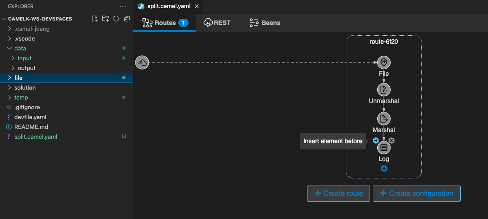
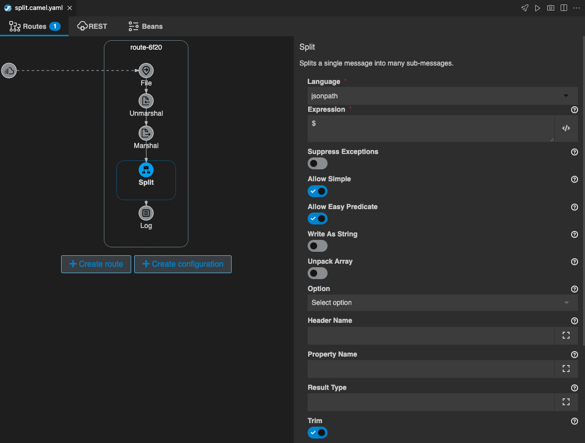
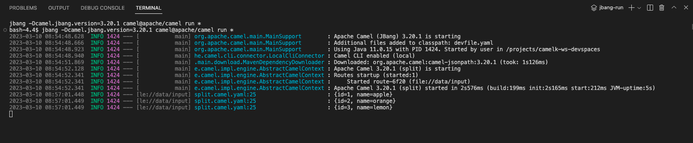
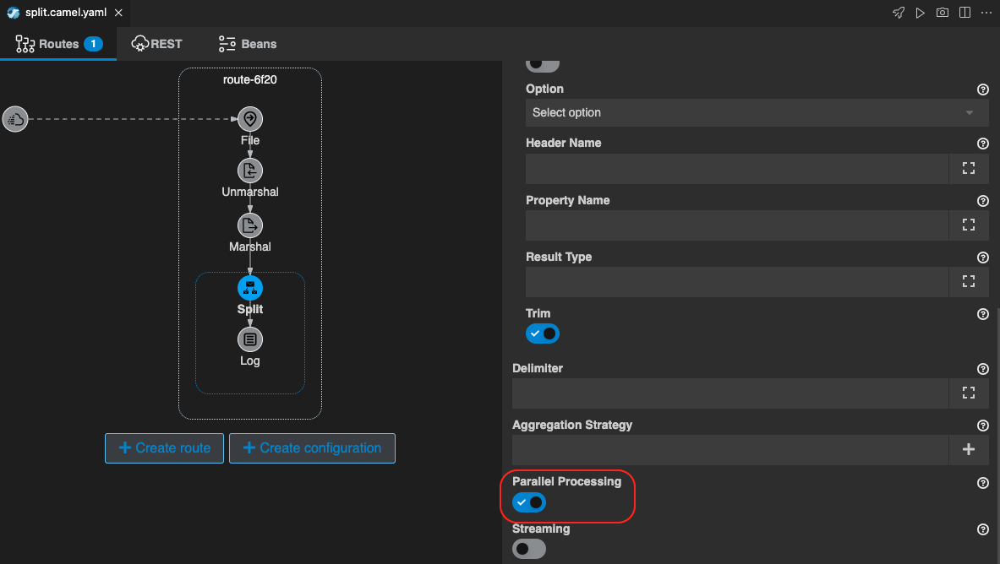
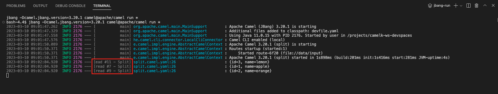

## Split パターン
---

### 1. 目的

[Split](https://camel.apache.org/components/{{ CAMEL_VERSION }}/eips/split-eip.html){:target="_blank"} を使用して、Camel K で Message を分割する方法について理解します。

---

### 2. Message の分割

前章の [DataFormatsパターン]({{ HOSTNAME_SUFFIX }}/workshop/camel-k/lab/data-formats){:target="_blank"} で 作成したインテグレーションを使用します。
まだ前章を実施していない場合は、先にそちらを実施して下さい。

前章で作成した、インテグレーションファイルをコピーし、`split.camel.yaml` という名前としてください。

左のエクスプローラー上で、`split.camel.yaml` 右クリックをして、メニューから `Karavan: Open` を選択し、Karavan Designer のGUIを開きます。

JSON形式のデータを、分割する処理を追加します。
Log シンボルにマウスカーソルを持っていくと、左上に小さく `→` ボタンが表示されますので、クリックします。

{:width="800px"}

続いて、`Routing` タブから `Split` を探して選択をしてください。
右上のテキストボックスに `Split` と入力をすると、絞り込みができます。

{:width="800px"}

`Split` のシンボルをクリックすると、右側にプロパティが表示されますので、
Parameters 項目に、以下の内容を設定してください。他の項目は、デフォルトのままで構いません。

* **Language**: jsonpath
* **Expression**: $

{:width="1200px"}

次に、`Log` 処理を `Split` で分割した直後のステップに移動します。

`Log` シンボルを左クリックでドラッグし、`Split` シンボルの上にドラッグしてください。

ポップアップ画面が表示されますので、`Move as target step` を選択してください。

{:width="1200px"}

これで、`Split` で分割した後のMessageの内容が表示されます。

{:width="800px"}

それでは、実際に動かしてみます。
右上の ロケットのアイコン のボタンを押してください。

ターミナルが開き、作成したインテグレーションが JBang を通して実行されます。
特にエラーなく実行されたら、左のエクスプローラー上で、`file/test_02.csv` を右クリックして、`Copy` し、`data/input` フォルダの中に `Paste` して、ファイルを指定のフォルダに格納してください。

ターミナルに以下のような Log が表示されます。
JSON形式のデータが分割されて、分割された処理毎に Log が出力されることが確認できます。

{:width="1200px"}

Log の確認ができたら、`Ctrl+C` もしくは、ターミナル右上のゴミ箱のアイコンをクリックして、終了してください。

---

### 3. Parallel Processing

次に、処理を停止した後、`Split` シンボルをクリックし、右側のプロパティから `Parallel Processing` を探してスイッチをオンにします。

{:width="1200px"}

それでは、もう一度実行をします。
右上の ロケットのアイコン のボタンを押してください。

ターミナルが開き、作成したインテグレーションが JBang を通して実行されます。
特にエラーなく実行されたら、もう一度、 左のエクスプローラー上で、`file/test_02.csv` を右クリックして、`Copy` し、`data/input` フォルダの中に `Paste` して、ファイルを指定のフォルダに格納してください。

ターミナルに以下のような Log が表示されます。分割されたデータの Log の表示が順不同になり、
赤枠で囲った部分を見ると、スレッドIDがそれぞれ異なっていることが確認できます。
（もし表示順が同じだった場合は、何度かやり直してみてください）

{:width="1200px"}

Logの確認後、`Ctrl+C` もしくは、ターミナル右上のゴミ箱のアイコンをクリックして、終了してください。
また、作成した `split.camel.yaml` を `temp` フォルダに移動をしておいてください。 