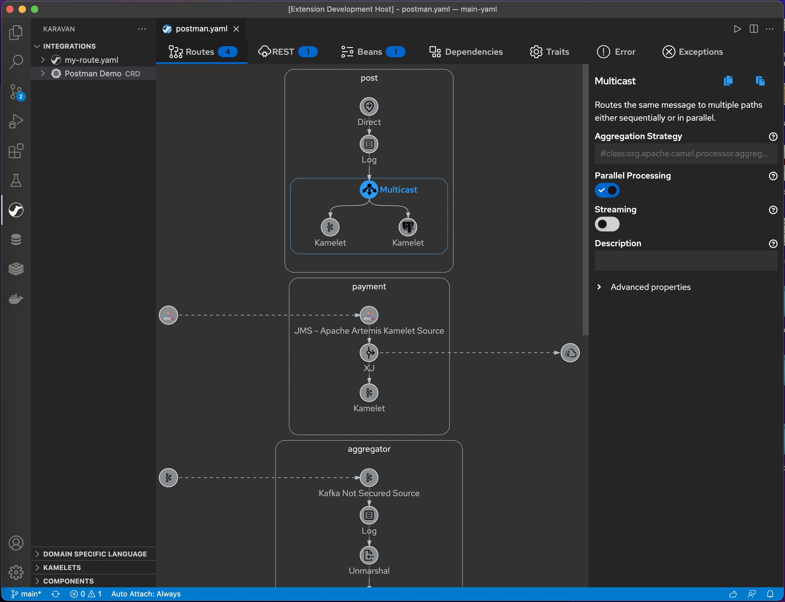
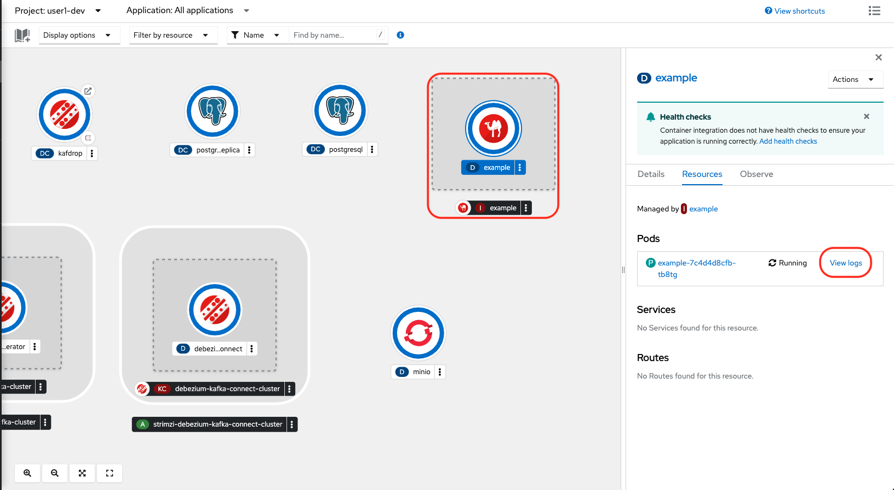

## 利用環境 について
---

このワークショップでは、簡単な Camel K インテグレーションを作成し、動作を確認すると共に、Karavan Designer を使用した 実装のイメージを把握していただきます。

本ワークショップの開発環境は、オープンソースの [Eclipse Che](https://www.eclipse.org/che/){:target="_blank"} プロジェクトに基づいた、OpenShift Container Platform で動作するWebベースの統合開発環境(IDE)である、[Red Hat OpenShift DevSpaces](https://developers.redhat.com/products/openshift-dev-spaces/overview){:target="_blank"} を使用します。

* OpenShift DevSpaces の特徴
  * あらかじめ定義された設定でワークスペースを作成するため、オンボーディングを高速にできるとともに、個々の開発者の開発環境を統一できます。
  * Gitからクローンされるソースコードは、ブラウザからアクセスするワークスペース上で管理されるため、ローカル環境への複製が不要です。
  * Visual Studio Code 拡張機能と互換性があり、VSCodeユーザーでも利用しやすいです。

{:width="1200px"}

ワークショップを開始する前の事前準備として、OpenShift DevSpaces のワークスペースを作成しておきます。
こちらのリンクから、[OpenShift Web Console]({{ CONSOLE_URL }}){:target="_blank"} にアクセスをしてください。
OpenShift Web Console にアクセスするための情報は以下の通りです。

* **Username**: {{ OPENSHIFT_USER }}
* **Password**: {{ OPENSHIFT_PASSWORD }}

{:width="800px"}

OpenShift Web Console にログイン後、左のメニュから `Developer` パースペクティブを選択し、その下のメニューから `Topology` ビューを開きます。Project名は `{{ OPENSHIFT_USER }}_dev` を選択してください。

{:width="1200px"}

### リソースについて

* **guides**: 本ワークショップのガイドドキュメント
* **kafka-cluster**: Kafka のクラスター
* **kafdrop**: Kafka 用の Web UI でブローカーやトピックなどの情報やメッセージの表示を行います
* **postgresql**: サンプルデータが格納されたPostgreSQL
* **postgresql-replica**: Debeziumを使用してデータを同期をするPostgreSQL
* **debezium**: データベースの更新をイベントに変換する Change Data Capture
* **minio**: Amazon S3と互換性のあるオブジェクト・ストレージ・サーバー

あらかじめ、KafkaやPostgreSQLといったリソースが用意されています。
ワークショップの中で、これらのデータソースを用いた連携をCamel Kで作成していきます。

### OpenShift DevSpacesの準備

こちらのリンクから、[OpenShift DevSpaces Dashboard](https://{{ DEVSPACES_URL }}){:target="_blank"} にログインします。
`Topology` ビューの OpenShift DevSpaces インスタンスの Route からもアクセスすることができます。Project名は `devspaces` を選択してください。

{:width="1200px"}

初回にアクセスすると、以下のような画面が表示されますので、`Log In with OpenShift` をクリックします。

{:width="600px"}

`Username` と `Password` は、先ほどの OpenShift の 認証情報を入力してください。
ログインに成功すると、以下のような画面が表示されますので、`Allow selected permissions` をクリックしてください。

{:width="600px"}

OpenShift DevSpaces の Dashboard が表示されます。
まだワークスペースは作成されておりません。
今回は、あらかじめ設定を用意したワークスペースをインポートしていきます。
`Import from Git` のテキスト欄に、`{{ DEVSPACES_REPO }}` と入力して、`Create & Open` をクリックします。

{:width="800px"}

ワークスペースの作成が始まりますので、完了までしばらく待ちます。

{:width="800px"}

ワークスペースの作成が完了すると、自動で以下のような画面にジャンプします。
`Trust the authors of all files in the parent folder 'projects'` にチェックを入れて、
`Yes, I trust the authors` をクリックします。その後、`Mark Done` をクリックしてください。
（エディタの外観を変えたい方は、設定を変更してみてください）

{:width="1200px"}

### Karavan Designer のインストール

[Karavan](https://github.com/apache/camel-karavan){:target="_blank"} は、Apache Camel 用の開発ツールキットです。ランタイムおよびパッケージとの統合や、イメージのビルド、kubernetesへのデプロイが可能な他、Camel K の Yaml DSL をグラフィカルに作成することができます。

{:width="1200px"}

OpenShift DevSpaces の左端のVSCODE拡張機能のメニューを選択します。
RECOMMENDED に Karavan が表示されていますので、選択してインストールを実施してください。

{:width="1200px"}

インストールが完了すると、左端のメニューにCamelのアイコンが表示されます。
エクスプローラ上で右クリックをして、karavan のメニューが表示される様になればOKです。

{:width="1200px"}

<!-- ## Karavan Updateで不要になった

続いて、Karavan の設定を確認します。
拡張機能の Karavan の歯車のアイコンをクリックし、 Extention Settings を選択してください。

{:width="800px"}

Remote のタブを選択し、`Camel: Version` を確認します。
Version は `3.20.3` を選択しておいてください。

{:width="800px"}

-->

### JBang によるインテグレーション実施のテスト

[JBang](https://www.jbang.dev/){:target="_blank"} は、Javaをスクリプトのように実行できるツールです。日本での知名度はまだまだ低いですが、Quarkusのエンジニアが開発していることもあり。モダンなJava開発環境との連携が充実しています。

今回のワークショップでは、karavan Designer で作成した Camel K インテグレーションを、JBang を通して実行し、動作を確認していきます。

ワークスペースに、１秒間に１回、コンソールに **hello** と出力をするサンプル用のファイル（example.camel.yaml）があります。

エクスプローラ上で右クリックをして、`Open in Integrated terminal` を選択してください。

{:width="300px"}

ターミナルが表示されますので、`jbang camel@apache/camel run example.camel.yaml` と入力をして実行してみてください。
ターミナルに以下のようなログが表示されればOKです。

{:width="1200px"}

ログを確認したら、`Ctrl+C` などで実行を終了してください。

#### Camel K CLI (Kamel)　による OpenShift　へのデプロイ

[CAMEL K CLI (Kamel)](https://camel.apache.org/camel-k/{{ CAMELK_VERSION }}/cli/cli.html){:target="_blank"} は、Kubernetes クラスタ上でインテグレーションを実行するためのエントリポイントです。

先ほどのサンプルを、OpenShiftへデプロイしてみます。

`kamel run example.camel.yaml -n {{ OPENSHIFT_USER }}_dev` とターミナルに入力してみてください。

ターミナルに以下のログが表示されて、OpenShiftに `example` のインテグレーションがデプロイされます。

{:width="600px"}

OpenShift Web Console の [Topology view]({{ CONSOLE_URL }}/topology/ns/{{ OPENSHIFT_USER }}-dev){:target="_blank"} にアクセスして確認します。
新しく、`example` の Pod が起動していますので、 `view logs` をクリックします。

{:width="1200px"}

先ほどと同じように、１秒間に１回、**hello** の文字列が出力されているのを確認してください。

{:width="1200px"}
